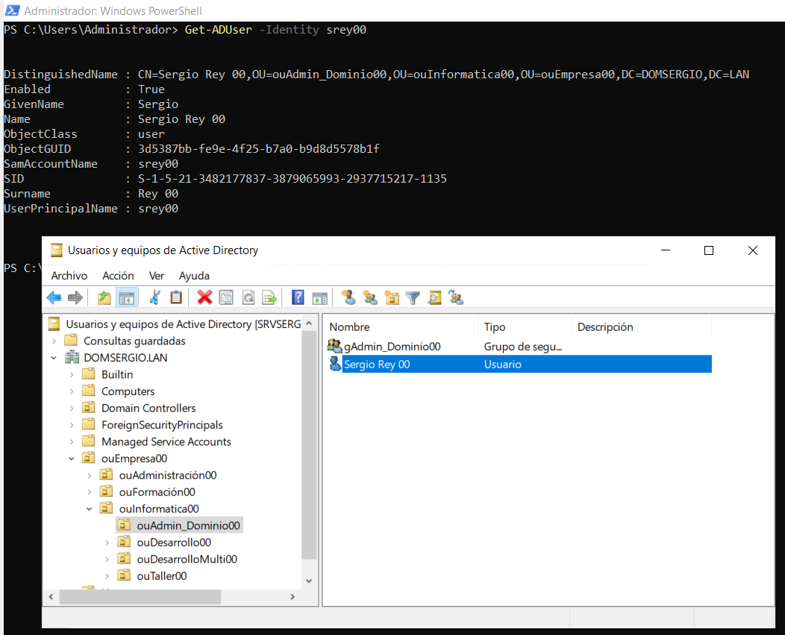

- [1. Conocimientos previos](#1-conocimientos-previos)
  - [1.1. LDAP y sus componentes](#11-ldap-y-sus-componentes)
  - [1.2. Módulos en ***PowerShell***](#12-módulos-en-powershell)
- [2. PowerShell para administración de *Active Directory*](#2-powershell-para-administración-de-active-directory)
  - [2.1. Comandos para la gestión de **usuarios**](#21-comandos-para-la-gestión-de-usuarios)
    - [2.1.1. `New-ADUser`](#211-new-aduser)
    - [2.1.2. `Remove-ADuser`](#212-remove-aduser)
    - [2.1.3. `Get-ADUser`](#213-get-aduser)
    - [2.1.4. `Set-ADUser`](#214-set-aduser)
    - [2.1.5. `Move-ADUser`](#215-move-aduser)
    - [2.1.6. `Enable-ADAccount` y `Disable-ADAccount`](#216-enable-adaccount-y-disable-adaccount)
  - [2.2. Comandos para la gestión de **grupos** de usuarios](#22-comandos-para-la-gestión-de-grupos-de-usuarios)
    - [2.2.1. `New-ADGroup`:](#221-new-adgroup)
    - [2.2.2. `Remove-ADGroup`:](#222-remove-adgroup)
    - [2.2.3. `Add-ADGRoupMember`](#223-add-adgroupmember)
    - [2.2.4. `Remove-ADGroupMember`](#224-remove-adgroupmember)
    - [2.2.5. `Get-ADGroupMember`](#225-get-adgroupmember)
    - [2.2.6. `Get-AdPrincipalGroupMembemship`](#226-get-adprincipalgroupmembemship)
  - [2.3. Comandos para la gestión de **Unidades Organizativas**](#23-comandos-para-la-gestión-de-unidades-organizativas)
    - [2.3.1. `New-ADOrganizationalUnit`](#231-new-adorganizationalunit)
    - [2.3.2. `Get-ADOrganizationalUnit`](#232-get-adorganizationalunit)
    - [2.3.3. `Remove-AdOrganizationaUnit`](#233-remove-adorganizationaunit)
  - [2.4. Modificar usuarios](#24-modificar-usuarios)
  - [2.5. Comando para la gestión de equipos](#25-comando-para-la-gestión-de-equipos)
    - [2.5.1. `New-ADComputer`](#251-new-adcomputer)
    - [2.5.2. `Set-ADComputer`](#252-set-adcomputer)
    - [2.5.3. `Get-ADComputer`](#253-get-adcomputer)
    - [2.5.4. `Remove-ADComputer`](#254-remove-adcomputer)
  - [2.6. Otros comandos de Active Directory](#26-otros-comandos-de-active-directory)
    - [2.6.1. `Get-ADObject`](#261-get-adobject)
    - [2.6.2. `Move-ADObject`](#262-move-adobject)
    - [2.6.3. `Get-ADForest`](#263-get-adforest)
    - [2.6.4. `Get-ADDomainCotroller`](#264-get-addomaincotroller)
    - [2.6.5. `search-ADAccount`](#265-search-adaccount)
    - [2.6.6. `Set-ADAccountExpiriation` y `Clear-ADAccountExpiration`](#266-set-adaccountexpiriation-y-clear-adaccountexpiration)
    - [2.6.7. `Unlock-ADAccount`](#267-unlock-adaccount)
    - [2.6.8. `Set-ADAccountPassword`](#268-set-adaccountpassword)
  - [2.7. Tabla resumen de comandos y sufijos](#27-tabla-resumen-de-comandos-y-sufijos)
  - [2.8. Filtros: Ejemplos de uso con comandos de Active Directory](#28-filtros-ejemplos-de-uso-con-comandos-de-active-directory)
- [3. Active Directory - Permisos](#3-active-directory---permisos)
  - [3.1. Gestión de permisos SMB](#31-gestión-de-permisos-smb)
    - [3.1.1. `New-SmbShare`](#311-new-smbshare)
    - [3.1.2. Sufijo `SmbShare`](#312-sufijo-smbshare)
  - [3.2. Gestión de Permisos NTFS](#32-gestión-de-permisos-ntfs)
    - [3.2.1. `Get-Acl` .Ver los permisos de una carpeta](#321-get-acl-ver-los-permisos-de-una-carpeta)
    - [3.2.2. Deshabilitar la herencia](#322-deshabilitar-la-herencia)
    - [3.2.3. Eliminar todos los permisos de un usuario](#323-eliminar-todos-los-permisos-de-un-usuario)
    - [3.2.4. Añadir permisos a un usuario](#324-añadir-permisos-a-un-usuario)
    - [3.2.5. Funcion **```New-Object System.Security.AccessControl.FileSystemAccessRule()```**](#325-funcion-new-object-systemsecurityaccesscontrolfilesystemaccessrule)


# 1. Conocimientos previos

## 1.1. LDAP y sus componentes

**LDAP** (“***Lightweight Directory Access Protocol***”) pertenece al grupo de los protocolos de red y se presenta como protocolo de acceso estandarizado para consultas y cambios según el modelo cliente-servidor en servicios de directorio distribuidos y centrales. 

**LDAP** se usa como medio de comunicación para directorios y servidores **LDAP** para buscar, cambiar o autenticar de manera eficiente atributos en un servicio de directorio complejo.

**LDAP** es, junto a *Kerberos*, *SMB* y *DNS,* uno de los cuatro protocolos estándar centrales que proporciona una comunicación y transmisión de datos fluidas en **Microsoft Active Directory**. Active directory se desarrolló para ser usado según el estándar LDAP


Así pues LDAP sirve de base para facilitar el uso de Active directory gracias a una serie de componentes y estructura determinada que se compone básicamente de:
- Directorios: es un árbol de entradas de directorio, jerarquizado.
- Entradas: cada entra consta de un conjunto de atributos. Por ejemplo, el nombre de usuario, contraseña, y otros detalles de identificación. Además, cada entrada tiene un identificador único con su DN (Distinguished Name).
- Atributos: los atributos tienen nombre y uno o más valores, son definidos en los esquemas.

Por ejemplo, para verlo de una forma más visual, una estructura básica de un LDAP podría parecerse a esta:

```
dn: cn=Empresa,dc=Simarro,dc=lan
cn: Administración
givenName: Pepito
sn: Pérez
telephoneNumber: +34 600 000 000
telephoneNumber: +34 611 111 111
mail: pepitoperez@simarro.lan
manager: cn= Administracion,dc=Simarro,dc=lan
objectClass: inetOrgPerson
objectClass: organizationalPerson
objectClass: person
objectClass: top
```

- **dn** (*domain name*): nombre de entrada, pero no forma parte de la propia entrada.
- **dc**: componente de dominio para identificar las partes del dominio donde se almacena el directorio LDAP.
- **cn** (*common name*): nombre de atributo para identificar el nombre de usuario, por ejemplo
- **sn** (*surname*): apellido del usuario
- **ou** (*Organizational unit*): para las unidades organizativas.


El resto de líneas son los atributos de la entrada, como el givenName, sn, telephoneNumber, mail y los diferentes objectClass que tenemos. Así es como se jerarquiza y se aloja toda esta información en la base de estos servidores LDAP. 

Veamos ahora como se aplica a nuestro caso en concreto, según se puede ver en la siguiente imagen:

<div align="center">
    
</div>

En esta caso, podemos ver cómo se compone la ruta, desde el nombre el usuario (**cn**) hasta el dominio (**dc**) pasando por todas las unidades organizativas (**ou**).

Para poder referenciar desde ***PowerShell*** un objeto del Active Directory, es necesario utilizar estas estructura LDAP para poder identificarlo.


## 1.2. Módulos en ***PowerShell***

Son paquetes que contienen comandos específicos para la administración de una faceta del sistema.

- `Get-Module` para listar los módulos que instalados en el sistema

```ps
Get-Module
Get-Module -ListAvailable   # Lista los módulos cargados o disponibles en el equipo (pero no cargados)
```

[Referencia de Microsoft PowerShell: Get modules installed on a computer](https://docs.microsoft.com/en-us/powershell/module/microsoft.powershell.core/Get-module?view=powershell-7.1#example-9--Get-modules-installed-on-a-computer)


Si queremos instalar un módulo nuevo porque necesitamos gestionar un característica o rol en concreto desde PowerShell, entonces debemos instalar el módulo mediante el comando `Import-Module`

- `Import-module` para instalar un nuevo módulo

```powershell 
import-module activeDirectory
Import-Module BitLocker         # Instala el módulo para poder gestionar el BitLocker
```

- `remove-module` para desinstalar módulos
- `Get-command -module activeDirectory` obtiene el listado de comando específicos de este paquete.

# 2. PowerShell para administración de *Active Directory*

Uno de los desempeños más habituales de los administradores de sistemas Microsoft Windows Server es la automatización de tareas mediante PowerShell.

Conocer los diferentes comandos PowerShell, es imprescindible para realizar *Scripts* que permitan esta automatización.

## 2.1. Comandos para la gestión de **usuarios**

Con los siguientes usuarios se puede realizar la gestión de todos los elementos que encontramos en la configuración de usuarios del sistema

### 2.1.1. `New-ADUser`

Para crear un usuario utilizamos el cmdlet `New-ADUser`. 

Ejemplo:
```powershell
New-ADUser -name usu1
```

Pero de esta manera no tendremos un usuario funcional ya que son necesarios más datos como el *fullname*, *samaccountname*, *contraseña*, etc.

El más necesario es la contraseña, debe ser del tipo *securestring*. En el siguiente ejemplo la solicitaremos al usuario para poderla asignar a posteriori al cmdlet, a través de la variable *$mipassword*.
```powershell
$mipassword=Read-Host “Introduce la contraseña” -assecurestring
```

Creamos otro usuario con contraseña:

```powershell
New-ADUser -name “usu2” -accountpassword $mipassword
```

También podemos poner una contraseña fija, una ubicación y habilitar la cuenta:
```powershell
New-ADUser -name “usu2” -accountpassword $(convertto-securestring “Abc123!” –asplaintext -force) -path “cn=users, DC=domiprofe,DC=curso” -Enabled $true –Passthru
```

> Con el parámetro `–passthru` obtenemos detalles durante la creación.

Si cambiamos el parámetro en el ejemplo anterior del `-accountpassword`, y ponemos la opción de solicitar password, durante la creación se solicitará por teclado al usuario.
```powershell 
-accountpassword $(read-Host “Contraseña” -asSecurestring)
```

y el cmdlet completo quedaría
```powershell
New-ADUser -name “usu2” -accountpassword $(read-Host “Contraseña” -asSecurestring) -path “cn=users, DC=domiprofe,DC=curso” -Enabled $true –Passthru
```

> Cuidado en la administración de sistemas con incluir este tipo de diálogos interactivos, ya que el objetivo último es automatizar y no tener que estar interactuando con un script que genera cientos de usuarios a partir de un listado.

Así pues los parámetros habituales que nos encontramos en `New-AdUser` son:

    - `-UserPrincipalName` : Establece el nombre del Login
    - ` -SamAccountName`: Para nombre anterior a Windows 2000
    - ` -Name`: Nombre de pila
    - ` -Surname`: Apellido/s
    - ` -DisplayName`: Nombre a mostrar
    - ` -Path` : Ubicación o dirección de árbol AD donde se crea el usuario
    - ` -Department` : Nombre del departamento
    - ` -AccountPassword (ConvertTo-SecureString -string "P@ssw0rd" -AsPlainText -Force)`: Password
    - ` -Enabled`: Si la cuenta esta habilitado o no
    - ` -ChangePasswordAtLogon`: Obliga o no a cambiar la contraseña en el primer inicio
    - ` -PassThru`: Muestra información detallada en caso de error


***Ejemplos*** de uso: 

```powershell
New-ADUser -UserPrincipalName "sbalmes" -SamAccountName "sbalmes" -Name "Santi" -Surname "Balmes" -DisplayName "Santi Balmes" -Path "OU=ouCantante,OU=ouLoveOfLesbian,OU=ouGrupoMusicales,DC=DOMSERGIO,DC=LAN" -Department "Grupos Españoles" -AccountPassword (ConvertTo-SecureString -string "P@ssw0rd" -AsPlainText -Force) -Enabled $true -ChangePasswordAtLogon:$false -PassThru

New-ADUser -DisplayName "alumno1" -Name "alumno1" -UserPrincipalName "alumno1" -Enabled:$true -Path "OU=usuarios,OU=Organizacion,DC=dominio,DC=lan" -AccountPassword (ConvertTo-SecureString -string "P@ssw0rd" -AsPlainText -Force) -ChangePasswordAtLogon:$True
```


### 2.1.2. `Remove-ADuser` 

Normalmente los usuarios en Active Directory no se suelen borrar ya que la práctica recomendada es desactivarlos.

Pero si decidimos hacerlo, hay que pasar unos valores determinados para identificar al usuario, como el Name, SID o SamAccountName al parámetro –identity, y ejecutarlo de la siguiente manera.

```powershell
Remove-ADUser -identity nombreusuario
``` 

Siempre se pide confirmación a no ser que utilicemos el parámetro `-Confirm:$false` De la misma manera podemos leer listas de usuarios de un archivo, seleccionar usuarios con Get-ADUser y pasarlos a este cmdlet. 

Ejemplo

```powershell
Remove-ADUser -identity alumno1 -confirm:$False #para no pedir confirmación
```


### 2.1.3. `Get-ADUser`

Mostrar los usuarios de una unidad organizativa

***Ejemplos*** de uso: 

```powershell
Get-ADUser -identity Alumno1
Get-ADUser -identity Alumno1 -properties *  # Todas las propiedades.
Get-ADUser -filter * -searchBase "ou=ouAlumnos,dc=domio,dc=lan"
Get-ADUser -filter "name -like 'U*'" 
Get-ADUser -filter "Name -eq 'Alumno1'"
Get-ADUser -filter * | ft Name, UserPrincipalName, Active   # con formato de tabla
Get-ADUser -filter {name -like "usu*"}  # todos los usuarios que comienzan por usu
Get-ADUser -filter * | format-table name,userPrincialName,enabled -A # formateamos información en columnas
Get-ADUser -filter * | format-table name,userPrincialName,enabled -A > listado.txt # Lo mismo de antes, pero lo guardmos en un documento de texto
Get-ADUser -filter * | ft name,userPrincialName,enabled -A # ojo ft es un alias de format-table
```

**Ejemplo**: Para meter la información de un usuario en una variable
Si metemos usuarios en una variable, después hacer uso en *Scripts*, por ejemplo con `forEach` podemos manipularlos

```powershell
$miusuario=Get-ADUser -filter { name -eq "usuario1"] -property *
Write-Host $miusuario.city  # Usamos la variable para acceer
$miusuarios=Get-ADUser -filter { name -like "usu*"] -property * # variable que teiene los usuarios
```


### 2.1.4. `Set-ADUser`
Modificar propiedades de los usuarios.

Si cambiamos una propiedad en una variable que tiene asignado un usuario, cambia en la variable que tenemos pero no en el AD.

Para poder actualizar hay que volver a volcar y por esto se hace con un *instance*

```powershell
set-ADUser -instance $miusuario
```

Cuando utilizamos el `Set-ADuser` si no fuera por la variable, se debería meter todo el usuario, organización , etc... 

```powershell
Set-ADUser -identity $miusuario -description "Descripción del usuario"
$misusario.description="Descripcion del usuario" #Otra forma de hacer lo mismo
Set-ADUser -identity $miusuario -department "Informática" -city "Ayora" -country "ES"
```

Podemos seleccionar un usuario en una variable para trabajar con el
```powershell
$usu3 = Get-ADUser -identity usuario3
$usu3.Name
```


### 2.1.5. `Move-ADUser`
Mover objetos entre Unidades Organizativas

```powershell
Move-ADObject "cn=usuario1,ou=grupo1,dc=dominio,dc=lan" -TargetPath "cn=usuario1,ou=grupo2,dc=dominio,dc=lan"
Get-ADUser -filter * -searchbase "ou=unidad1,dc=dominio,dc=lan" | Move-AdObject -targetPath "ou=unidad2,dc=domino,dc=lan" # para mover automaticamente¡
Get-ADUser -filter'name -like "j*" ' -searchbase "ou=unidad1,dc=dominio,dc=lan" | Move-AdObject -targetPath "ou=unidad2,dc=domino,dc=lan" # aplicando filtros
```


### 2.1.6. `Enable-ADAccount` y `Disable-ADAccount`

Por lo general cuando un usuario deja la empresa su cuenta se desactiva, podemos tener casos en los que se sigan políticas más estrictas en cuanto a seguridad, en las que cada vez que un usuario esté de vacaciones, se realice un proceso de desactivación y posterior activación de la cuenta

Para activar un usuario usaremos el cmdlet `Enable-ADAccount` y para desactivar el `Disable-ADAccount` Para ejecutar estos cmdlets se necesita identificar al usuario a través de alguna de las siguientes propiedades:
- **Distinguished Name (DN) **o n**ombre LDAP**. Por ejemplo `CN=nombredeusuario,OU=miou,DC=domiprofe,DC=curso`
- **ObjectGUID**. Por ejemplo `954199er-0df4-6571-b437-5rt42001b11d`
- **Security Identifier** (SID) Ej.: **S-1-5-21-653638456-1125679544-1145158610-1114**
- **SAMAccountName**. Por ejemplo `nombredeusuario`

Podemos conseguir esos valores con `Get-ADUser` y usarlos en el cmdlet, como vemos a continuación:

```powershell
Disable-ADAccount-identity usu1 –passthru   # Desactivamos el usuario usu1.
Enable-ADAccount  -identity usu1 –passthru    # Activamos el usuario usu1.
```
> Con `-passthru` se fuerza la salida de un resultado por la ejecución del comando.

***Ejemplo*** de uso: si queremos desactivar todos los usuarios de una unidad organizativa podemos hacerlo con el siguiente comando:

```powershell
Get-ADUser -searchbase "OU=miou,DC=domiprofe,DC=curso" -filter * | disable-adaccount
```

***Ejemplo*** de uso: Dado un fichero con un listado de usuarios, habilitarlos / deshabilitarlos

```powershell
Cat usuarios.txt | ?{ Enable-ADAccount -identity $_}                        # Habilitar
Get-Content usuarios.txt | Where-Object { Disable-ADAccount -identity $_}   # Deshabilitar (sin alias)
```

## 2.2. Comandos para la gestión de **grupos** de usuarios


### 2.2.1. `New-ADGroup`: 

Para Crear un grupo usamos el cmdLet `New-ADGroup`, por ejemplo:

```powershell 
New-ADGroup -Name "g_alumnos" -SamAccountName "gAlumnos" -GroupCategory Security -GroupScope Global -DisplayName "grupo de alumnos" -Path "OU=grupo,OU=ouAlumnos,DC=dominio,DC=lan" -Description "grupo de alumnos"
```

En el siguiente ejemplo creamos el grupo *migrupo* de tipo seguridad y de ámbito global en el contenedor users del dominio *domiprofe.curso*.
```powershell
New-adgroup –name "migrupo" -groupcategory security –groupscope global -path "cn=users, DC=domiprofe,DC=curso"
```

Creamos otro grupo de seguridad global llamado *migrupo2* en la unidad organizativa *otraou* con `displayname` y descripción.

```powershell
New-AdGroup -Name "migrupo2" -GroupCategory Security -GroupScope Global -displayname "Mi Segundo grupo" -Path "OU=otraou, DC=domiprofe, DC=curso" -Description "Todos los grupos"
```

### 2.2.2. `Remove-ADGroup`: 

Elimina grupo de usuarios

```powershell
Remove-ADGroup -identity migrupo  # Borramos el grupo anteriormente creado.
Remove-ADGroup -identity gAlumnos
```

### 2.2.3. `Add-ADGRoupMember`

Añadir usuarios a grupos

```powershell
Add-ADGRoupMember -identity grupo -members usuario1
```

### 2.2.4. `Remove-ADGroupMember`

eliminar usuario de grupo

```powershell
Remove-ADGroupMember –Identity migrupo -Members usu1  # Eliminamos el usu1 del grupo indicado.
Remove-ADGroupMember -identity grupo -members usuario1
```

### 2.2.5. `Get-ADGroupMember`
Consulta de usuarios que pertenecen al grupo administrador

```powershell
$(Get-ADGroupMember -identity "Administradores") | select name
```

### 2.2.6. `Get-AdPrincipalGroupMembemship`

Saber a qué grupos pertenece un usuario

```powershell
Get-AdPrincipalGroupMembemship - identity administrador | Sort-Object | FT -property name, class -A
```
- **FT** : Para formato de tabla Format-Table
- **-A** : parámetro para autoajuste


## 2.3. Comandos para la gestión de **Unidades Organizativas**

### 2.3.1. `New-ADOrganizationalUnit`

Crear una UNIDAD ORGANIZATIVA   

```powershell
New-ADOrganizationalUnit -DisplayName "ouAlumnos" -Name "ouAlumnos" -path "DC=doinio,DC=lan"
New-ADOrganizationalUnit -Name "miunidaduo" –path “dc=domiprofe,dc=curso”
```

***Ejemplos*** de uso: Deshabilitando todas las cuenta de una unidad organizativa en concreto
```powershell
Get-ADUser -SearchBase "OU=ouAlumnos,DC=dominio,DC=lan" -filter * | Disable-ADCount
```

El **_-filter *_** es necesario por que tenemos que tener filtros si o si, entonces es obligatorio ponerlo


### 2.3.2. `Get-ADOrganizationalUnit`

para obtener datos de la unidad organizativa

```powershell
Get-ADOrganizationalUnit -path "ou=ouISO,ou=ouAsix,ou=ouCFGS,DC=DOMSimarro,DC=lan"
Get-ADOrganizationalUnit "OU=miunidaduo, dc=domiprofe,dc=curso"
Get-ADOrganizationalUnit -Filter 'Name -like "m*"'
```

### 2.3.3. `Remove-AdOrganizationaUnit`

Para eliminar unidad organizativa

Por defecto no se pueden eliminar una unidad organizativas, por el parámetro 

- `-ProtectedFromAccidentalDeletion`


> Para ver esto desde la ventana en el entorno visual, dentro del objeto, está el check en propiedades avanzadas

En el caso de powershell también hay que habilitar para que se pueda eliminar

- `-recursive` para borrar todo lo que contenga dentro

***Ejemplos*** de uso: 

```powershell
Set-ADOrganizationalUnit -identity "ou=organizacion,dc=domiprofe, dc=curso" -ProtectedFromAccidentialDeletion $FAlse
Remove-AdOrganizationaUnit -identity "ou=organization,dc=domiprofe,dc=curso"
Remove-AdOrganizationaUnit -identity "ou=organization,dc=domiprofe,dc=curso" -recursive # para borrar todo lo que tenga dentro
```

## 2.4. Modificar usuarios

Para modificar las propiedades de un usuario, se usa el cmdlet `Set-ADUser`. Lo primero que tenemos que hacer para modificar una propiedad de un usuario o usuarios es conocer qué tipo de dato acepta cada propiedad para saber qué le podemos asignar.

Para ello podemos asignar una búsqueda de usuarios a una variable, por ejemplo:

```powershell
$misusuarios=Get-ADUser -filter “Name -like ‘s*’” -property # Guardamos en una variable todos los usuarios que empiezan por u.
$misusuarios                                                # Mostramos todas las propiedades de estos usuarios.
$misusuarios.name                                           # Mostramos solo la propiedad name.
```

En línea de comandos es mejor manipular un solo usuario, para varios usuarios es mejor un script.

```powershell
$miusu=Get-ADUser -filter “name -eq ‘srey00’” -property # Asignamos el objeto usuario srey00 a la variable $miusu.
```

Una vez hecho esto, podemos escribir:

```powershell
$miusu
# ó
$miusu.created 
```
Vemos todas las propiedades o solo una. Se ven sin necesidad de poner `Write-Output`

Añadiendo un gettype al final nos indicará de qué tipo de dato se trata.

```powershell
$miusu.description.gettype() 
```

Cuidado, porque da error si la propiedad no tiene valor.

Hay que tener en cuenta que es una variable que contiene el objeto. Si no ha recibido información de una de ellas porque no tiene datos, no puede darla.

En este caso, si la descripción existía, nos indica que es un string. Podemos modificarla de la siguiente manera, usando parámetros de `set-aduser`:
```powershell
Set-ADUser -identity $miusu -description “nueva descripción”
```

O también podríamos hacerlo de una manera menos directa usando la variable:

```powershell
$miusu.description = “nueva descripción” 
```
Si optamos por esto último. No olvidar pasarlo al AD, de la siguiente forma: `Set-ADUser -instance $miusu`

De la misma manera también podemos actualizar diversas propiedades a la vez, pasando directamente valores o pasando variables en las que previamente las hayamos
almacenado:

```powershell
set-ADUser -identity $miusu -department “Informatica” -city “Xàtiva” -country “España”
```

Modificamos las propiedades indicadas al usuario contenido en $miusu

```powershell
set-ADUser -identity "us4" -department “Informatica” -city “Xàtiva” -country “ES”
```

Modificamos las propiedades indicadas al usuario concreto us4.

Otro ejemplo, si pusiéramos:

```powershell
set-ADUser -identity $misusuarios -department “Informatica” -city “Xàtiva” -country “ES”
```

Se aplicarían los cambios en estas propiedades, a todos los usuarios contenidos en la variable que anteriormente hemos usado.


## 2.5. Comando para la gestión de equipos

### 2.5.1. `New-ADComputer`
Para crear con anterioridad un equipo y que se ubique en un lugar especifico

***Ejemplos*** de uso: 

```powershell
New-ADComputer -name equipo1 -path "ou=organizacion,dc=domiprofe,dc=curso" -PassThru
```
> **-PassThru** para que muestren detalle de la salida.

### 2.5.2. `Set-ADComputer`
Para modificar un objeto de tipo Computer

```powershell
Set-ADComputer -identity equipo1 -description "PC del usuario 1"
```

### 2.5.3. `Get-ADComputer`
Para seleccionar un computador.

***Ejemplos*** de uso: Para habilitar / deshabilitar: Obtenemos el equipo y lo obtenido se lo pasamos a la order de habilitar o deshabilitar
```powershell
Get-ADComputer -filter * -searchbase "ou=uniddad,dc=domiprofe,dc=curso" | disable-ADAccount
Get-ADComputer -filter * -searchbase "ou=uniddad,dc=domiprofe,dc=curso" | enable-ADAccount
```

### 2.5.4. `Remove-ADComputer`
Borrar equipo

```powershell
remove-ADComputer -identity equipo1
```

## 2.6. Otros comandos de Active Directory

### 2.6.1. `Get-ADObject`

Obtiene cualquier tipo de objetos (que filtremos) mientras que el resto de **Get-AD..** específica que tipo de objeto queremos


***Ejemplos*** de uso: Listar de unidades organizativas; Buscando en los objetos del dominio y dentro de las unidades organizativas.

```powershell
Get-ADObject -filter { objectClass -eq 'organizationalunit'}
Get-ADOrganizationalUnit -filter 'name -like "ou*"'  # Lista de unidades organizativas que comienzan por ou  
```


### 2.6.2. `Move-ADObject`
Para poder mover un ordenador de sitio de grupo a otro, o cualquier otro objeto
```powershell
Move-ADObject "cn=equipo1,ou=grupo1,dc=dominio,dc=lan" -TargetPath "cn=equipo1,ou=grupo2,dc=dominio,dc=lan"
```


### 2.6.3. `Get-ADForest`
Conocer el tipo de bosque dentro del bosque genérico

```powershell
Get-ADForest | Select-Object -ExpandProperty ForestMode
Get-ADDoain | Select-Object  -ExpandPropertyh domainMode
```

### 2.6.4. `Get-ADDomainCotroller`
Búsqueda de información del controlador del dominio. EL PC donde esta instalado el dominio. 

```powershell
Get-ADDomainCotroller -filter * 
Get-ADDomainCotroller -filter * | FT name, domain, site, ipv4address, operatingsystem
```

### 2.6.5. `search-ADAccount` 

Búsquedas de cuentas. En este caso tenemos ejemplos de obtener las cuentas inactivas
```powershell
Get-ADUser -filter {Enabled -eq $false} | select Name, userPrincpalName | Sort Name
search-ADAccount -AccountDisabled -UsersOnly | Format-Table name, objectClass
search-ADAccount -AccountDisabled -UsersOnly | Format-Table name, lasLogonDate, Lockedout, objectclass, passwordexpired, prasswordneverexpires

# Consoltar usuarios/cuentas por fechas
# los que han estado inactivos durante los últimos 9 días.
Search-ADAccount -AccountInactive -TimeSpan 90.00:00:00 -UserOnly | FT Name, ObjectClass  

# que no se han conectado nunca
Get-ADUser -filter * -Properites LastLogonDate | ? { $_.LastLogonName -eq $null } | Select name
```

### 2.6.6. `Set-ADAccountExpiriation` y `Clear-ADAccountExpiration`

Establecer inicio y expiración de las cuentas
```powershell
Set-ADAccountExpiriation -Identity usuario1 -datetime "30/06/2021"
Clear-ADAccountExpiration -identity usuario1 # anualción de fecha de expiración
```

### 2.6.7. `Unlock-ADAccount`

Desbloqueo de cuenta de usuario, por ejemplo al fallar el password.

No hay comando de bloqueo, solo de desbloqueo
```powershell
Unlock-ADAccount -identity usuario1

# busqueda de cuentas bloqueadas y las debloquea automáticamente
search-account -lockedout | unlock-ADAccount -passthru -confirm

# Encuentra los usuarios deshabilitados dentro de un grupo
Get-ADGroupMember -identity "secndariauni10" -Recursive | %{Get-ADUser -identity $_.distingueshedNAme -Propierties Enabled | ....}
```

### 2.6.8. `Set-ADAccountPassword`
Cambio de password de usuario de usuarios

```powershell
Set-ADAccountPassword -identity usuario1 -reset -newpassword (ConvertTo-SecureString -asPlaintText "Pass1234" -Force)
```
- `ConvertTo-SecureString` para cifrar la contraseña que se indica


**Ejemplos** finales: 
- Crear un grupo de seguridad en una ou
```powershell
New-ADGroup -Name "miGrupo" -GroupCategory Security -GroupScope Global -displayName "miGrupo" -Path "OU=ouUsuarios, DC=dominio, DC=lan"
```

- Cambiar un grupo de tipo: Pasarlo a universal de distribución, y además le añade un usuario como adminstrador del grupo
```powershell
Set-ADGroup -identity 'migrupo' -groupcategory Distribution -groupscope Universal -Managedby 'usuario1' 
```

- Obetner un número de usuario de una lista concreta y con una fecha de expiracíon.
```powershell
$(Get-ADUser -properties AccountExpirationDate -filter {memberof -recursivematch } | Select name, accountExpirationDate | where ($_.AccountExperitionDate -ne $null).count )
```

## 2.7. Tabla resumen de comandos y sufijos


| Prefijo | Sufijo |
| --- | --- |
| `ADUser` | `New-ADUser` \| `Remove.ADUser` \| `Set-ADUser` \| `Get-ADUser` |
| `ADGroup` | `New-ADGroup` \| `Remove-ADGroup` \| `Set-ADGroup` \| `Get-ADGroup` \| `Add-ADGroupMember` \| `Remove-AdGroupMember` \| `Get-ADGroupMember` |
| `ADOrganizationalUnit` | `New-ADOrganizationalUnit` \| `Remove-ADOrganizationalUnit` \| `Set-ADOrganizationalUnit` \| `Get-ADOrganizationalUnit` | 
| `ADComputer` | `New-ADComputer` \| `Remove-ADComputer` \| `Set-ADComputer` \| `Get-ADComputer` |
| `ADAccount` | `Enable-ADAccount` \| `Disable-ADAccount` \| `Search-ADAccount` \| `Unlock-ADAccount` \| `Set-ADAccountPassword` \| `Set-ADAccountExpiration` \| `Clear-ADAccountExpiration` \| `Set-ADAccountControl` |
| `ADObject` | `New-ADObject` \| `Get-ADObject` \| `Set-ADObject` \| `Sync-ADObject` \| `Move-ADObject` \| `Remove-ADObject` \| `Rename-ADObject` \| `Restore-ADObject` |
| `ADPrincipalGroupMembership` | `Add-AdPrincipalGroupMembership` \| `Set-AdPrincipalGroupMembership` \| `Remove-ADPrincipalGroupMembership` | 
| `ADDomain` | `Set-ADDomain` \| `Get-ADDomain` \| `Set-ADDomainMode` \| `Get-ADDomainController` | 
| `ADForest` | `Set-ADForest` \| `Get-ADForest` \| `Set-ADForestMode` | 


## 2.8. Filtros: Ejemplos de uso con comandos de Active Directory

A continuación batería de consultas a poder realizar con lo visto anteriormente

```powershell
$(Get-ADUser -filter *).count
# cuenta todos los usuarios del AD

(Get-ADUser -filter *).count 
# también funciona

$(Get-ADUser -filter * -searchbase "ou=unidad,dc=dominio=dc=lan").count 
# cuenta de una unidad organizativas especifica

$(Get-adgroupmember -identity "administradores").count 
# Adminstradores

$(Get-adgroup -filter * -searchbase "dc=dominio=dc=lan").count  
# contamos grupos dados de alta en AD

$(Get-ADUser -filter *  | Where-Object {$_.enabled -eq $True}).count  
# Usuarios habilitados

$fecha = ((Get-date).addDays(-7))
# Consulta de usuarios que se han creado durante los últimos 7 días

$(Get-ADUser -filter * -Properties * | Where-Object {$_.whenCreated -ge $fecha}).count | select Name, whenCreated | Sort Name 
# Usuarios habilitados
# Eb este caso **-properties** es redundante porque ya forma parte el * (asterisco) del filtro anterior

$(Get-ADUser -filter * -properties * | where{ $_.passwordNeverExpieres -eq $false } ) | select Name | sort Name
# Consulta de usuarios que tienen contaseña sin caducidad

$(Get-ADGroup -filter *) | select name, groupCategory, groupScope | Format-Table
# Consultar todos los grupos del sistema

Get-ADGroupMember -identity “Administradores” | select name  
# Mostramos los nombres de los usuarios del grupo Administradores del dominio

Get-ADPrincipalGroupMembership -identity administrador | Sort-object | FT -property name, samaccountname –A
# Mostramos los grupos a los que pertenece un usuario. La opción –A significa autosize. El autosize si no cabe en una columna lo autocompleta, es decir estira la columna de format-table.

Get-ADForest| Select-Object -ExpandProperty ForestMode 
# Obtenemos el nivel del bosque de Active Directory. Solo pone el tipo de bosque al que pertenece

Get-ADDomain | Select-Object -ExpandProperty domainmode 
#Obtenemos el nivel de domino de Active Directory, es decir, lo mismo de antes pero con el dominio

Get-ADDomainController -Filter 
# Muestra todos los datos del controlador de dominio

Get-ADDomainController -Filter * | FT name,domain, forest,site, ipv4address, operatingsystem 
# Muestra los datos seleccionados del controlador de dominio

Get-ADUser -Filter “Enabled -eq '$false'” | Select Name, UserPrincipalName | Sort name
# Mostramos usuarios con cuentas deshabilitadas, nombres y los FQN (nombres certificados), ordenados por nombre.

Search-ADAccount –AccountDisabled | FT Name,ObjectClass 
# Otra forma de mostrar cuentas deshabilitadas usando parámetro de cmdlet y no filtros. Además mostramos la clase del objeto.

Search-ADAccount -AccountDisabled -UsersOnly| FT name,lastlogondate, lockedout, objectclass, passwordexpired, passwordneverexpires 
# Encuentra usuarios con las cuentas deshabilitadas, y mostramos los datos indicados en formato tabla.

Search-ADAccount -AccountInactive -TimeSpan 90.00:00:00 -UsersOnly |Sort-Object | FT Name,ObjectClass 
# Encuentra las cuentas de usuarios que no han sido utilizadas durante los últimos 90 días, y los muestra clasificados con sus nombres y clase de objeto.

Get-ADUser -Filter * -Properties LastLogonDate | ? { $_.LastLogonDate -eq $null } | Select name 
# Encuentra los usuarios que no han iniciado nunca la sesión y muestra solo sus nombres.

Set-ADAccountExpiration -Identity usu1 -datetime “31/12/2021” 
# Configura la cuenta de usuario usu1 para que expire el 31/12/2021

Clear-ADAccountExpiration -identity usu1
# Deshabilita la fecha de caducidad de la cuenta usu1

Unlock-ADAccount -identity usu1 
# Desbloquea la cuenta usu1. El bloqueo viene provocado porque agota el número intentos fallidos en la introducción de la contraseña.

search-adaccount -lockedout | unlock -adaccount -passthru -confirm:$false
# Encuentra y desbloquea todas las cuentas bloqueadas en Active Directory. Si añadiéramos un filtro para un grupo o usuario podríamos desbloquearlos solo a ellos.

Get-ADGroupMember -Identity “secundariauni10” -Recursive | %{Get-ADUser -Identity $_.distinguishedName -Properties Enabled | ?{$_.Enabled -eq $false}} | Select DistinguishedName,Enabled 
# Encuentra los usuarios deshabilitados en el grupo secundariauni10, utilizando filtros. Recordad que distinguishedName es el nombre LDAP.

Set-ADAccountPassword -identity u1 -reset -newpassword (Convertto-Securestring -asplaintext “Passw0rd123!” -Force) 
#Cambiamos la contraseña del usuario u1 usando la conversión de un string a string cifrado. Otro ejemplo para filtrar los usuarios dentro de una ruta concreta en base a su ubicación y fecha de caducidad de cuenta, también llamada fecha de expiración, si la tiene. 

(Get-ADUser -filter * -searchbase "dc=domiprofe,dc=curso" -properties accountexpirationdate|select name,accountexpirationdate | where {$_.accountexpirationdate -ne $null}).count
# Mostramos el número de usuarios con fecha de caducidad de cuenta, de todo el dominio

(Get-ADUser -filter * -searchbase "ou=curso,dc=domiprofe,dc=curso" -properties accountexpirationdate|select name,accountexpirationdate|where {$_.accountexpirationdate -ne $null}).count
# De la unidad organizativa curso, mostramos el número de usuarios con fecha de caducidad de cuenta.
```

Hay que tener en cuenta que si hay uno solo no muestra nada. Sólo cuenta 2 o más. Sin embargo, si mostramos los nombres con .name siempre funciona. Por ejemplo:
```powershell
(Get-ADUser -filter * -searchbase "ou=curso,dc=domiprofe,dc=curso" -properties accountexpirationdate|select name,accountexpirationdate|where {$_.ccountexpirationdate -ne $null}).name
```


# 3. Active Directory - Permisos

## 3.1. Gestión de permisos SMB

### 3.1.1. `New-SmbShare`

Para asignar premisos SMB, o sea, compartir, una carpeta, utilizamos el comando `New-SmbShare`

Para sintaxis y más información sobre el comando: [Microsoft New-SmbShare](https://learn.microsoft.com/en-us/powershell/module/smbshare/new-smbshare?view=windowsserver2022-ps

Ejemplo para asignar permisos SMB

```powershell 
New-SmbShare -Name CarpetaNueva -Path E:\Desarrollo\ -FullAccess Administradores -ChangeAccess gDesarrollo,gAdministracion -ReadAccess gTrabajadores

```

Otra forma, utilizando una variable que contiene todos los datos:

```powershell
$Parameters = @{
    Name = 'VMSFiles'
    Path = 'C:\ClusterStorage\Volume1\VMFiles'
    FullAccess = 'Contoso\Administrator', 'Contoso\Contoso-HV1$'
}
New-SmbShare @Parameters
```

y otro ejemplo, otorgando multiples permisos:

```powershell
$Parameters = @{
    Name = 'VMSFiles'
    Path = 'C:\ClusterStorage\Volume1\VMFiles'
    ChangeAccess = 'CONTOSO\Finance Users','CONTOSO\HR Users'
    FullAccess = 'Administrators'
}
New-SmbShare @Parameters
```

### 3.1.2. Sufijo `SmbShare`

Como hemos vistos hata ahora, tenemos multiples derivadas del sufijo `SmbShare` como `Get-SmbShare`, `Set-SmbShare` o `Remove-SmbShare`

Consulta el listado completo de comandos en la documentación de [Microsoft SmbShare](https://learn.microsoft.com/es-es/powershell/module/smbshare/?view=windowsserver2022-ps)


## 3.2. Gestión de Permisos NTFS

La gestión de los permisos NTFS depende directamente de la gestión de seguridad del sistema, porque se aplica a los permisos de las carpetas, tanto si se accede localmente o remotamente a traves de SMB. Por ello, la mayoría de la gestión esta incluida en el módulo [Microsoft.PowerShell.Security](https://learn.microsoft.com/es-es/powershell/module/microsoft.powershell.security/?view=powershell-7.3) y en especial en cmdlets como `Get-Acl` y `Set-Acl`

No obstante, para la gestión de l

Los siguentes comando describien como manipular los permisos NTFS de una carpeta

### 3.2.1. `Get-Acl` .Ver los permisos de una carpeta

En primer lugar es esencial tener una forma de ver todos los permisos de una carpeta. 

A continuación vemos la mejor forma. 

Por una parte la función ```Get-ACL``` obtiene el listado de permiso, y mediante el método ```Access``` los muestra. Utilizamos la funcion ```Format-Table``` para visualizar en forma de tabla.
Por último, creamos una variable donde vamos a almacenar la dirección de la carpeta o fichero con el que vamos a trabajar. Esto no es necesario, pero puede servir para reutilizar código de forma sencilla si cambiamos de carpeta o fichero.

```powershell
$Carpeta="c:\CarpetaCompartida"
(Get-ACL -Path $Carpeta).Access | Format-Table IdentityReference, FileSystemRights, AccessControlType, IsInherited, InheritanceFlags -AutoSize
```

### 3.2.2. Deshabilitar la herencia

Para poder eliminar ciertos permisos debemos deshacer la herencia de los mismos.
Lo realizamos mediante la funcion ```SetAccessRuleProtection``` tal y como vemos a continuación.
Como podemos ver, en primer lugar metemos en una variable el listado de permisos que obtenemos mediante la funcion ```Get-ACL``` y después una vez eliminados los permisos en la variable, se vuelven a volcar o aplicar al recurso inicial mediante la función ```Set-ACL```

```powershell
$ACL = Get-Acl -Path $Carpeta                                                             
$ACL.SetAccessRuleProtection( $true, $true)                                                      
$ACL | Set-Acl -Path $Carpeta                                                             
```

### 3.2.3. Eliminar todos los permisos de un usuario

Para eliminar los permisos de un recurso, comenzamos como siempre obteniendo en una variable todos los permisos, y mediante el filtro ```Where-Object``` filtramos y obtenemos los permisos concretos que queremos eliminar.

La eliminación se realiza mediante la función ```Acl-RemoveAccessRule```, y posteriormente, como en el caso anteior, volvemos a asignar los nuevos permisos al recurso inicial

```powershell
$Acl = Get-Acl -Path $Carpeta
$AccessRule = $Ace.Access | Where-Object {($_.IdentityReference -eq 'BUILTIN\Usuarios') -and -not ($_.IsInherited)}
$Acl.RemoveAccessRule( $AccessRule)
$Acl | Set-Acl -Path $Carpeta
$Acl.Access | Format-Table IdentityReference, FileSystemRights, AccessControlType, IsInherited, InheritanceFlags -AutoSize
```

### 3.2.4. Añadir permisos a un usuario

Para añadir un nuevo permiso a una carpeta, creamos el permiso mediante la función ```New-Object System.Security.AccessControl.FileSystemAccessRule()``` y asígnamos en orden los valores para el usuario o grupo de seguridad, los permisos que tiene, opciones de herencia y de propagación, y el tipo de permiso que se esta aplicando, que puede ser de permiso o de denegación del mismo.
Una vez creado el nuevo permiso, se añade al listado ACL de la carpeta y por último, como siempre, se reescriben todos los permisos de la carpeta

```powershell
$Acl = Get-Acl -Path $Carpeta
$AccessRule = New-Object System.Security.AccessControl.FileSystemAccessRule(.....) # Explicación más abajo
$Acl.AddAccessRule( $AccessRule)
$ACL | Set-Acl -Path $Carpeta
```

### 3.2.5. Funcion **```New-Object System.Security.AccessControl.FileSystemAccessRule()```**

Función que crea un permiso específico NTFS.

A continuación se detallan los posibles valores que pueden tomar cada uno de los parámetros de la funcioń

| Parámetro | Valores |
| --- | --- |
| ***name*** | Usuario o grupo de seguridad |
| ***FileSystemRights*** | ListDirectory, ReadData, WriteData, CreateFiles, CreateDirectories, AppendData, ReadExtendedAttributes, WriteExtendedAttributes, Traverse, ExecuteFile, DeleteSubdirectoriesAndFiles, ReadAttributes, WriteAttributes, Write, Delete, ReadPermissions, Read, ReadAndExecute, Modify, ChangePermissions, TakeOwnership, Synchronize, FullControl | 
| ***InheritanceFlags*** | None, ContainerInherit, ObjectInherit | 
| ***PropagationFlags*** | None, NoPropagateInherit, InheritOnly | 
| ***AccessControlType*** | Allow, Deny | 


 

