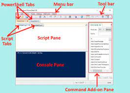

- [1. Scripts powershell](#1-scripts-powershell)
  - [1.1. PowerShell ISE](#11-powershell-ise)
  - [1.2. Notas Generales](#12-notas-generales)
- [2. Estructuras de control (condiciones y bucles) en `PowerShell`](#2-estructuras-de-control-condiciones-y-bucles-en-powershell)
  - [2.1. Condiciones con estructuras **`IF`**](#21-condiciones-con-estructuras-if)
  - [2.2. Condiciones con  **`switch`**](#22-condiciones-con--switch)
  - [2.3. Bucles con estructura **`for`**](#23-bucles-con-estructura-for)
  - [2.4. Bucles con estructura **`while`**](#24-bucles-con-estructura-while)
  - [2.5. Bucles con estructura **`foreach`**](#25-bucles-con-estructura-foreach)
- [3. Parámetros](#3-parámetros)
- [4. Funciones](#4-funciones)
- [5. Variables de entorno](#5-variables-de-entorno)
- [6. Lectura de ficheros](#6-lectura-de-ficheros)


# 1. Scripts powershell

Tal y como vimos en GNU/Linux, en PowerShell también podemos hacer uso de los *scripts* para automatizar tareas administrativas.

En PowerShell, los scripts deben ser ficheros con extension **.ps1**. Esto indicará al sistema que se trata de un *script* desarrollado mediante PoserShell.

Su ejecución se realizará haciendo doble click sobre el fichero con esta extension **.ps1** o escribiendo en la consola de PowerShell el nombre de dicho fichero como por ejemplo **.\script.ps1**

Mas información en ***Microsoft Learn*** [¿Qué es PowerShell?](https://learn.microsoft.com/es-es/powershell/scripting/overview?view=powershell-7.3)

## 1.1. PowerShell ISE

Windows PowerShell Integrated Scripting Environment (ISE) es una aplicación host de Windows PowerShell. En el ISE, puede ejecutar comandos y escribir, probar y depurar scripts en una única interfaz gráfica de usuario basada en Windows. El ISE proporciona edición de varias líneas, finalización con tabulación, color de sintaxis, ejecución selectiva, ayuda contextual y compatibilidad con idiomas de derecha a izquierda.

<div align="center">
    
</div>

Mas información: 

## 1.2. Notas Generales
- **Comentarios**. Se utiliza *#* y *<# #>* para bloques
- Las **variables** se ponen siempre con **$** delante
    - Si quiero que una variable tengo un tipo concreto, hay que ponerlo delante con **[ ]**. Solo se puede utilizar con ese tipo.
- **GetType().name** muestra que tipo de objeto es
- **Write-Output** para la escritura y el **Read-Host** para la lectura de datos
- los **arrays** se definen como elementos separado por comas. No se si hay otra forma.

**Variables en `PowerSHell`.**

Sirven para almacenar cualquier dato u objeto. 

La definición de una variable se realiza mediante el símbolo (**$**) Dólar delante del nombre de la variable.

```powershell
Write-Output "hola"	# lo mismo que echo
$varInt=1 # Variable de tipo entero
$varDecimal=1.95 #para decimales hay que utilizar un 'punto' .
```

Se trata de objeto que pueden almacenar datos, y pueden cambiar de tipo en cualquier momento.

Pero si indicamos el tipo de dato que va a almacenar, ya no podemos utilizar esta variable para otro tipo de datos diferente:

```powershell
[int]$numeroEntoro=55   # define una variabla para datos enteros; números sin decimales.
$numeroEntero="hola"	# esto da un error porque esta variable se ha especificado que es entera

[boolean]$vedad=$true       # para booleanos
[decimal]$varDecimal=1.234	# para número decimales
[byte]::minValue            # nos indica el valor mínimo de este tipo
[int16]::minValue           # nos indica el valor mínimo de este tipo
[int]::minValue             # nos indica el valor mínimo de este tipo
[int32]::maxvalue           # nos indica el valor máximo de este tipo
[char]$variableLetra="a"	# solo admite una letra
[string]$varCadena="Hola Amigo como estas"	#para una cadena

$numero=4,5	        # Tiene una COMA, que se utiliza para almacenar arrays
$numero.GetType()	# Retorna que es de tipo objeto. un array
$numero=4.5	        # Tiene una PUNTO, que se utiliza para valores numéricos
$numero.GetType()	# Retorna que es de tipo double, un número real

Write-Output $numeroEntero.GetType().name #Muestra el tipo de la variable
Write-Output "El rango de valores va desde $([decimal]::MinValue) hasta el $([decimal]::MaxValue) "
```

# 2. Estructuras de control (condiciones y bucles) en `PowerShell`

## 2.1. Condiciones con estructuras **`IF`**

- Ojo, no tiene **then** y el **else** y **elseif** si **no** lo pones en una línea sola no funciona

```powershell
$lenguaje = Read-Host "Introduce un idioma"
if ($lenguaje -eq "alemán")
{
    Write-Output "El lenguaje es alemán."
} 
elseif ( $lenguaje -eq "francés")
{
    "El lenguaje es francés."
}
else
{ 
    Write-Output "No estaba en las opciones. Es el $lenguaje"
}
```

Otro ejemplo con número
```powershell 
$cadena = Read-Host( "introduce un número: ")
echo $cadena.GetType().Name;

$num = [int]$cadena

echo $num.GetType().Name

if ($num -gt 100) {
    Write-Output " El número es mayor de 100"
} elseif ( $num -eq 100) {
    Write-Output " El número es igual de 100"
} else {
    Write-Output " El número es menor de 100"
}
```


## 2.2. Condiciones con  **`switch`**
Ojo que va todo metido entre llaves: Tanto todas las accionesa a realizar, como cada una de las acciones. 
```powershell
# ****** Ejemplo con switch *************
$lenguaje = Read-Host "Introduce un idioma"
switch ($lenguaje) {
    "aleman" { write-output "Parece que es aleman" }
    "ingles" { write-output "Parece que es ingles" }
    "frances" { write-output "Parece que es frances" }
    Default { Write-Output "Pues no es ni uno ni el otro"}
}
```

y otro ejemplo con números:
```powershell
# ****** Ejemplo con switch *************
$opcion = Read-Host "Introduce una opción del 1 al 3"
switch ($opcion) {
    1 { write-output "Seleccionada opción 1" }
    2 { write-output "Seleccionada opción 2" }
    3 { write-output "Seleccionada opción 3" }
    Default { Write-Output "Pues no has sido capaz de poner entre uno y tres"}
}
```

## 2.3. Bucles con estructura **`for`**

```powershell
$num = Read-Host "Introduce un número entre 0 y 10"
$num = [int]$num  # si no comvertimos a entero, no va la multiplicación
for ($i=0; $i -le 10; $i++){
    Write-Output ("$num x $i = " + $($num * $i)) 
}
```

## 2.4. Bucles con estructura **`while`**
De nuevo la misma tabla de mutiplicar , pero con el while. 
```powershell
$num = Read-Host "Introduce un número entre 0 y 10"
$num = [int]$num  # si no comvertimos a entero, no va la multiplicación
$i = 1
while ( $i -le 10){
    Write-Output ("$num x $i = " + $($num * $i))
    $i++ 
}
```
También esta la estructura `do..until` 

## 2.5. Bucles con estructura **`foreach`**
Tenemos un **array** que se define con elementos separados por comas
```powershell
$array = 1, "dos", 3, "cuatro", 5

foreach ( $item in $array)
{
    write-output $item
}
```

- Listando elementos de un directorio
```powershell
$miDir = Get-ChildItem c:\temp

foreach ( $item in $miDir)
{
    write-output $item
}
```

- leer el contenido de un fichero
```powershell
Get-Content lista.txt
$miFich = Get-Content lista.txt
$i = 0
foreach ( $item in $miFich)
{
    $i++
    write-output "Linea $i : $item"
}
```

-  ejemplo de listar y mostrar
```powershell
$lista = Get-ChildItem c:\windows | where{$_.Attributes -match 'readonly'}
$lista = Get-ChildItem c:\windows | where{$_.Name -like 'w*'}
foreach ( $item in $lista)
{
    write-output "$item"
}
```

- En el siguiente ejemplo podemos ver que se muestra el mismo resultado si hacemos una tubería directamente al **ForEach** (***%***)


```powershell
$lista = Get-ChildItem c:\windows | %{$_.Name + "--->" + $_.Length}
foreach ( $item in $lista)
{
    write-output "$item"
}

Write-Output "----------------------MUESTRA OTRA VEZ LO MISMO ---------------------"

Get-ChildItem c:\windows | %{$_.Name + "--->" + $_.Length}
```

- Podemos utilizar el **ForEach** para sumar o recorrer automáticamente la lista

```powershell
$suma= 0
Get-ChildItem c:\windows | ForEach{$suma += $_.Length}
Write-Output "Tamaño de los elementos: $suma"
```

y otra versión de lo mismo con más datos

```powershell
$suma= 0
Get-ChildItem c:\windows | ForEach{
    write-output( $_.name + "  --  " + $_.Length)
    $suma += $_.Length
}
Write-Output "Tamaño de los elementos: $suma"
```

# 3. Parámetros

Visto en `02_parametros.ps1`

Para la definición de parámetros en un Script, hay que definir un bloque **Param** y ahí se especifican los parámetros entre paréntesis separados por comas, con o sin tipo
```powershell
Param(
    $Primero,
    $Segundo = "valor por defecto"
)
```
Ahora con tipo de para cada uno de los parámetros
```powershell
Param(
    [string]$Primero,
    [string]$Segundo = "valor por defecto",
    [double]$tercero =456.72,
    [bool]$cuarto = $false,
    [int]$Quinto,
    [ValidateSet("lunes", "martes", "miercoles", "Jueves")][string] $diaSemana,
    [ValidateRange(1..32)] [int] $diames
    [Parameter(Mandatory=$true)][string] $obligatorio #parámetro obligatorio
)
```
Para llamar a estos scripts
```powershell
.\script.ps1 -seguundo pepe -cuarto $true
```

# 4. Funciones

Visto en `03_funciones.ps1`

Ejemplo de funciones y su uso:
```powershell
#Funcion que suma a piñon fijo dos valores
function suma{
  $total=45+50
  write-host ("Resultado : " + $total)
}

# función que suma dos valores. Hay que especificar el algún momento que se trata de enteros
function suma2{
    param( 
      $par1, 
      $par2)
    $total=[int]$par1 + [int]$par2
    write-host( "Resultado 2 : " + $total)
}

# y otra función que calcula la potencia, y se especifica que los parámetros son enteros
function potencia{
  param( 
    [int]$basep,
    [int]$exponentep
  )
  $total = 1
  for ( $i =1; $i -le $exponentep; $i++ ){
    $total*=$basep
  }
    write-host( "Resultado expt : " + $total)
}

# Para hacer bonito el script, seleccionamos el tipo de operación que queremos hacer
$opcion = Read-host "Introuce opcion: 1 suma, 2 suma2 y 3 potencia"
$opcion = [int]$opcion
# y la invocamos.
switch ($opcion) {
  2 { 
    $sum1 = read-host "introduce el sumando 1"
    $sum2 = read-host "introduce el sumando 2"
    suma2 -par1 $sum1 -par2 $sum2
  }
  1 {
    suma
  }
  3{
    $base = read-host "introduce la base"
    $expo = read-host "introduce el exponente"
    potencia -basep $base -exponentep $expo
  }
  Default {
    write-host "Que triste que no sepas meter un 1, 2 o 3"
  }
}
```

# 5. Variables de entorno
Para ver todas las variables de entorno
```powershell
Get-ChildItem env:
```
Para ver el valor de las variables de entorno:
```powershell
write-host $env:USERPROFILE # para ver el directorio del usuario actual
write-host $env:PATH    #para ver los PATH
```

Para reasignar una variable de entorno. Aunque en este caso, el sistema restaura el path cuando sales
```powershell
$env:Path+=Get-Location
```
> **Nota**: Podemos parametrizar la ejecución de scripts o predefinir variables, para cada usuario
  - En el directorio c:\users\Sergio\Documents\WindowsPowerShell
    - **profile.ps1** --> indica perfiles de ejecución de la shell
    - **Microsoft.powershell_profile.ps1** --> lo que se pone aquí afecta a los que se ejecuta powershell en mi usuario 


# 6. Lectura de ficheros 

Uno de los aspectos fundamentales es la ejecución de script en función de información que llega en ficheros de textos

La forma fácil de leer el contenido de un archivo cargando el archivo en una variable.

```powershell
$mifich = cat nombres.txt

foreach ($nombre in $mifich)
{
    echo ( "Creando " + $nombre)
    mkdir $nombre
    # rmdir $nombre
}
```

Hacemos lo mismo que antes pero pasando fichero como parámetro y trabajando la variable que contiene el contenido del fichero como un vector

```powershell
param([string]$fichero)

$contenido= Get-Content $fichero #Asignamos el contenido de un fichero a una variable que es un vector
$numero = 0
while ($numero -lt $contenido.Length)
{
  # Write-Host ($numero + 1) " " $contenido[$numero]
  echo ( ""+ ($numero + 1) + ":" + $contenido[$numero])
  $numero++
}
echo "El fichero tiene $numero líneas"
```


