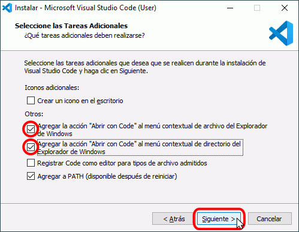
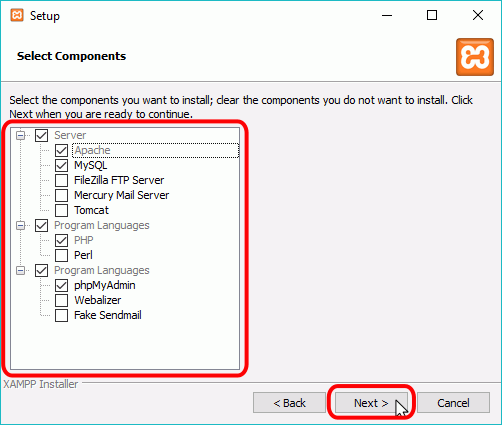

# Software necesario

<div style="text-align: right">
<!--
<a target="_blank" href="slides/01b.html"></a>&nbsp;&nbsp;
-->
<a target="_blank" href="01b.pdf"></a>
</div>

<div></div>

A la hora de trabajar con Laravel, necesitamos tener previamente instalados en nuestro sistema una serie de recursos software, como son:

1. Un IDE (entorno de desarrollo) con el que editar el código de nuestros proyectos. Emplearemos Visual Studio Code en estos apuntes, aunque existen otras alternativas similares, como PHPStorm, Sublime Text, Atom, etc.
2. Un servidor web que soporte PHP. En nuestro caso, utilizaremos Apache.
3. Un servidor de bases de datos en el que almacenar la información de nuestras aplicaciones. Emplearemos un servidor MariaDB/MySQL.
4. PHP actualizado a una versión compatible con la versión de Laravel que vayamos a utilizar. Por ejemplo, para Laravel versión 9 se necesita una versión de PHP 8.0 o posterior.
5. El propio framework Laravel. Se necesitará instalar la herramienta `composer` para, después, instalar Laravel. Aunque también se pueden crear proyectos Laravel desde la propia herramienta *composer*, como veremos más adelante.
6. Además, necesitaremos el gestor de paquetes `npm` para instalar dependencias del lado del cliente en proyectos Laravel. Este gestor se instala con el framework Node.js.
7. Otras herramientas adicionales que nos puedan venir bien, como por ejemplo alguna herramienta para probar el acceso a los servicios REST que desarrollemos.

Veremos a continuación los pasos necesarios para instalar todo el software que utilizaremos. Se darán las pautas de instalación en un sistema Linux basado en Debian, como por ejemplo Ubuntu, Lubuntu, Linux Mint, etc. También se facilitará en [esta otra sección](#6-recursos-adicionales) de este documento un enlace a una máquina virtual donde poder instalar todo el software, así como otra máquina virtual con el software ya preinstalado y listo para utilizarse, usando las versiones que se indican a lo largo del documento.

Para **usuarios de otros sistemas**, como Windows o Mac OSX, la mayoría de opciones que veremos aquí son igualmente válidas (cambiando la ruta y/o el modo de instalación de algunas herramientas). En cualquier caso, se puede hacer uso de otras herramientas alternativas, como por ejemplo:

* [Laragon](https://laragon.org/) para Windows, un sistema que integra los componentes de los puntos 2 a 6 vistos antes (servidor web, de base de datos, PHP, Node, etc).
* [Laravel Homestead](https://laravel.com/docs/homestead), un ecosistema basado en máquinas virtuales que también integra distintos componentes necesarios para desarrollar aplicaciones Laravel, aunque más complejo de instalar y configurar que Laragon o los pasos que seguiremos aquí en la máquina virtual.

En cualquier caso, no es el propósito de este curso aprender a instalar todo el software en todos los sistemas posibles, y es por ello que proporcionamos la máquina virtual indicada, para simplificar las opciones. Veremos algunas pinceladas de cómo instalar ciertas herramientas en varios sistemas, no obstante.

## 1. Visual Studio Code

Como IDE para desarrollar nuestras aplicaciones emplearemos **Visual Studio Code**, que es uno de los IDEs más versátiles que existen hoy en día para desarrollo web. Desde la [web oficial](https://code.visualstudio.com/) de Visual Studio Code podemos descargarlo para la plataforma deseada.

> **Versión requerida**: ninguna en particular, sirve con la última versión disponible.

**Linux (Debian)**

En el caso de nuestra máquina virtual o una distribución similar, descargaremos un archivo *.deb*. Una vez descargado, accedemos por terminal a la carpeta donde esté y ejecutamos este comando para instalarlo:

```
sudo dpkg -i nombre_del_archivo.deb
```

Se creará automáticamente un acceso directo en el menú de inicio, dentro de la sección de *Programación* en el caso de Lubuntu.

**Windows**

Para Windows descargamos el instalador y seguimos los pasos. No hay mucho que configurar; en todo caso, podemos dejar marcada la casilla para añadir el menú contextual "*Abrir con Code*" para poder abrir archivos y carpetas con VS Code desde el explorador de archivos directamente, con un clic derecho.

<div align="center">
    
</div>

**Mac OSX**

Para **Mac OSX**, descargamos la aplicación y la podemos ejecutar directamente. También podemos moverla a la carpeta de *Aplicaciones* para tenerla localizada.

<div align="center">
    
</div>


## 2. Apache, PHP y MariaDB/MySQL con XAMPP

Para poder tener un sistema con Apache, PHP y un gestor de bases de datos (como MariaDB/MySQL), y poderlo gestionar cómodamente, trabajaremos con un sistema AMPP, paquetes que integran en una sola instalación todas estas cosas. El ejemplo más conocido de estos sistemas es **XAMPP**, aunque existen otros como WAMPP, para Windows. Una de las ventajas que ofrecen es que, además de instalar Apache, PHP y MySQL y dejarlo todo integrado, nos proporciona un cliente web llamado **phpMyAdmin** para poder administrar las bases de datos desde Apache. Esto nos vendrá bien para crear o importar las bases de datos de los distintos ejercicios.

> **Versión requerida**: depende sobre todo de la versión de Laravel con la que vayamos a trabajar. En el caso por ejemplo de Laravel 9, es necesario tener al menos una versión de PHP 8.0, y para ello debemos contar con una versión de XAMPP 8.x.

### 2.1. Instalación

Para instalar XAMPP, basta con descargarlo de su [web oficial](https://www.apachefriends.org/es/index.html) y seguir los pasos del asistente. Nos basta con tener instalado Apache, MySQL y PHP, así que podemos descartar otras opciones que nos ofrezca, si nos da a elegir. 

**Linux**

En el caso de Linux, debemos dar permisos de ejecución y ejecutar el archivo *.run* que descarguemos desde algún terminal, con permisos de administrador (*sudo*). Suponiendo que el archivo se llame *xampp-linux-x64-7.4.5-installer.run*, por ejemplo, los pasos son los siguientes (desde la carpeta donde lo hemos descargado):

```
sudo chmod +x xampp-linux-x64-7.4.5-installer.run
sudo ./xampp-linux-x64-7.4.5-installer.run
```

**Windows y MacOSX**

En el caso de **Windows** o **Mac OSX** simplemente hay que lanzar el instalador y seguir los pasos, eligiendo las opciones que nos interese instalar (al menos, Apache, MySQL y PHP), si nos dan a elegir. Así es como podemos dejarlo en el caso de Windows, por ejemplo:

<div align="center">
    
</div>

#### El manager de XAMPP

XAMPP proporciona una herramienta *manager* o *panel de control* que nos permite gestionar en todo momento los servicios activos.

En el caso de **Linux** se encuentra en **/opt/lampp/manager-linux-x64.run**. Podemos acceder a la carpeta desde el terminal para ejecutarlo (con permisos de superusuario), o bien crear algún acceso directo en otra ubicación que nos resulte más cómoda. Por ejemplo, podemos crear un acceso directo en el escritorio con el editor *nano* o con el propio editor Visual Studio Code que hemos instalado previamente. Suponiendo la carpeta */home/alumno/Escritorio/* o */home/alumno/Desktop/*, como la que tenemos en la máquina virtual, podemos primero crear el archivo vacío:

```
touch /home/alumno/Desktop/XAMPP.desktop
```

Editamos el contenido del archivo y añadimos las líneas de configuración para el acceso directo:

```
[Desktop Entry]
Encoding=UTF-8
Name=Manager XAMPP
Comment=Manager XAMPP
Exec=sudo /opt/lampp/manager-linux-x64.run
Icon=/opt/lampp/htdocs/favicon.ico
Categories=Aplicaciones;Programación;Web
Version=8.1.6
Type=Application
Terminal=1
```

> **NOTA**: la versión del programa (atributo *Version*) dependerá de la versión que hayamos instalado de XAMPP en el momento concreto. El atributo *Terminal* lo ponemos a 1 para poder especificar el password de superusuario al ejecutar, de lo contrario no funcionará.

En el caso de **Windows**, dicho manager está en la carpeta de instalación (típicamente *C:\xampp*), en un archivo llamado *xampp-control.exe*, que podemos ejecutar. En el caso de **Mac OSX**, se habrá creado un acceso en la sección de *Aplicaciones* para poder poner en marcha este manager.

<div align="center">
    
</div>

El manager nos permitirá lanzar o detener cada servidor. Para las pruebas que haremos deberemos tener iniciados tanto Apache como MySQL. En Linux y Mac OS X tendrá una apariencia como ésta aproximadamente:

<div align="center">
    
</div>

En el caso de Windows la apariencia es algo diferente, aunque igualmente funcional:

<div align="center">
    
</div>

Por defecto, Apache estará escuchando en el puerto 80 (o 443 para conexiones SSL), y MySQL en el 3306. Podemos modificar estos puertos en los respectivos archivos de configuración ("*httpd.conf*" y "*my.cnf*"), dentro de las carpetas de la instalación de XAMPP (la ubicación concreta de estos archivos varía entre versiones y entre sistemas operativos).

## 3. Thunder Client

Esta herramienta nos servirá para simular peticiones a servidores web, y recoger y analizar la respuesta. La emplearemos para probar los servicios REST que desarrollaremos en algunas sesiones. Se instala como una extensión de Visual Studio Code. La buscamos en el panel de extensiones y la instalamos:

<div align="center">
    
</div>

Nos aparecerá un icono en el panel izquierdo desde el que gestionaremos las conexiones y peticiones (aprenderemos a utilizarlo más adelante):

<div align="center">
    
</div>

Como alternativa, también podemos utilizar la herramienta **Postman**, o bien vía web o instalando la aplicación de escritorio desde su [web oficial](https://www.postman.com/).

## 4. Laravel

Para trabajar con Laravel, será necesario instalar el gestor de paquetes **composer** mediante el que podremos tanto crear proyectos Laravel como gestionar las dependencias de otros módulos en un proyecto.

> **Versión requerida**: en la última actualización de estos apuntes, se dispone de la versión 2.3.x de la herramienta **composer** y de la versión 9.x de Laravel.

### 4.1. Instalando *composer*

Como hemos comentado, la instalación de Laravel se realiza a través del gestor de paquetes **composer**. Ésta es una herramienta muy habitual en ecosistemas PHP, y su labor es similar a la que desempeña el gestor NPM para aplicaciones JavaScript: gestionar las dependencias de un determinado proyecto, descargando, actualizando o desinstalando los paquetes necesarios. En este caso, lo utilizaremos para descargar e instalar el propio framework Laravel.

Composer puede instalarse localmente para cada proyecto web, o de forma global para todo el sistema. Esta última opción es la recomendable en el caso de querer gestionar varios proyectos en nuestro equipo, para no tener que instalarlo en todos ellos. 

**Linux y Mac OSX**

Para instalar *composer* en Linux y Mac OSX, debemos descargar el archivo `composer.phar` de la [web oficial](https://getcomposer.org/download/) y copiarlo renombrado a `composer` desde donde lo hayamos descargado a alguna carpeta que forme parte del PATH del sistema, y activarlo como ejecutable. Por ejemplo:

```
mv composer.phar composer
sudo mv composer /usr/local/bin/composer
sudo chmod +x /usr/local/bin/composer
```

Como último paso, y ya que Composer utiliza el ejecutable de PHP, necesitamos que dicho ejecutable esté también en el PATH del sistema. 

* Para Linux deberemos hacer lo siguiente:

```
echo "export PATH=$PATH:/opt/lampp/bin" >> ~/.bashrc
source ~/.bashrc
```

* Para Mac OSX, es posible que se tenga alguna versión previa de PHP instalada con alguna otra herramienta. Para superponer la nueva versión de XAMPP a esta otra, podemos hacer este cambio en el PATH:

```
echo "export PATH=/Applications/XAMPP/xamppfiles/bin:$PATH" >> ~/.bash_profile
source ~/.bash_profile
```

Además, en el caso de Mac OSX quizá tengamos que editar el archivo de configuración de PHP (*/Applications/XAMPP/xamppfiles/etc/php.ini*) y añadir esta línea al final, para permitir que el comando PHP gestione la memoria:

``` 
pcre.jit=0
```

**Windows**

Para instalar *composer* en Windows debemos hacerlo a través de un instalador que también podemos descargar desde la [web oficial](https://getcomposer.org/download/), en la sección *Windows Installer*. Seguimos los pasos del asistente, y deberemos indicar la ruta donde se encuentra el comando *php*, necesario para poder utilizar la herramienta. Añadimos este comando al PATH del sistema también:

<div align="center">
    
</div>

**Comprobación de la instalación**

Una vez instalado, podemos ejecutar el comando `composer` sin más en un terminal, y comprobar que muestra una salida con las opciones que ofrece:

<div align="center">
    
</div>

### 4.2. Instalando Laravel

A través de la herramienta `composer` se pueden crear directamente proyectos Laravel, como veremos en el curso. Sin embargo, la sintaxis del comando de creación es algo larga, si la comparamos con el instalador de Laravel, por lo que vamos a instalarlo también. Para hacerlo, usamos la propia herramienta `composer`, con este comando:

```
composer global require laravel/installer
```

En el caso de **Windows**, este comando ya deja el instalador `laravel` listo para poderse ejecutar desde terminal. Para Linux y Mac OSX, deberemos añadirlo al PATH del sistema (en realidad, añadimos la carpeta con las utilidades que *composer* instala de forma global al sistema).

**Linux:**

```
echo "export PATH=$PATH:$HOME/.config/composer/vendor/bin" >> ~/.bashrc
source ~/.bashrc
```

>**NOTA**: en algunos sistemas la carpeta que hay que incluir en el PATH es `$HOME/composer/vendor/bin` en lugar de la anterior.

**Mac OSX:**

```
echo "export PATH=$PATH:$HOME/.composer/vendor/bin" >> ~/.bash_profile
source ~/.bash_profile
```

Con esto, se habrá instalado un comando llamado `laravel`, que podemos utilizar a partir de ahora para crear los proyectos. Podemos probar a ejecutarlo en un terminal para que nos muestre las opciones disponibles, lo que indicará que está correctamente instalado y localizado.

### 4.3. Actualizando Laravel

En general, el comando `laravel` que se instala se encargará de crear proyectos empleando la última versión de Laravel que haya disponible. Así, si por ejemplo lo instalamos cuando aún existía la versión 7 de Laravel pero se publica la versión 8, automáticamente el comando `laravel` nos permitirá crear proyectos de la versión 8 desde ese punto. Sin embargo, es posible que con el tiempo se requiera actualizar el instalador para que los proyectos con nuevas versiones se sigan creando sin problemas.

Para poder actualizar a la versión más reciente de Laravel, tenemos dos opciones, aunque es cierto que ninguna de ellas está recogida en la documentación oficial de Laravel, y lo que aquí se menciona se basa en recomendaciones de webs externas a Laravel.

La primera forma de actualizar es utilizar el comando de actualización:

```
composer global update laravel/installer
```

Sin embargo, esta opción puede no ser suficiente si el cambio es demasiado brusco (por ejemplo, pasar de Laravel 5 a Laravel 7), ya que algunas dependencias que también haya instaladas harían inviable el cambio. En este caso, podemos optar por quitar la versión instalada por completo, e instalar la reciente:

```
composer global remove laravel/installer
composer global require laravel/installer
```

## 5. Node.js

A pesar de que podría parecer que *Node.js* es un ecosistema diferente a Laravel, lo cierto es que con la instalación de Node se incorpora una herramienta muy útil en cualquier aplicación web que utilice librerías JavaScript, como puedan ser Bootstrap o jQuery. Es la herramienta **NPM** (*Node Package Manager*), que permite instalar de forma sencilla estas librerías en cualquier proyecto.

> **Versión requerida**: es recomendable tener instalada la última versión LTS (*Long Term Support*). En la última versión de estos apuntes, dicha versión es la 16.x.

Para instalar Node en cualquiera de los sistemas que estamos contemplando (Linux, Windows o Mac OSX) podemos optar por:

* Instalarlo a través del *instalador* correspondiente
* Utilizar la herramienta NVM (*Node Version Manager*). Esta herramienta nos va a permitir tener más de una versión de Node instalada, y poder elegir en todo momento cuál de ellas es la que queremos tener activa. En el caso de Windows, la herramienta NVM que podemos utilizar no es la "oficial", pero sí existe una especie de clon alternativo funcional.

### 5.1. Instalación en Linux

En el caso de distribuciones Linux, como es el caso de la máquina virtual proporcionada, podemos optar por ejecutar un instalador o por usar NVM. En la versión completa de la máquina virtual proporcionada se ha optado por esta última opción (NVM), pero damos aquí los pasos a seguir para ambas opciones.

**Opción de instalador**

Si optamos por instalar Node.js a través de un instalador, los pasos a seguir son:

1. En primer lugar, si no tenemos instalada la herramienta `curl`, la instalamos con:

```
sudo apt-get install curl
```

2. Después, utilizamos `curl` para recuperar la versión de Node que queramos (versión LTS actual, 14.x):

```
curl -sL https://deb.nodesource.com/setup_16.x | sudo -E bash -
```

3. Finalmente, instalamos Node.js

```
sudo apt-get install -y nodejs
```

Si quisiéramos actualizar la versión de Node.js en un futuro, bastaría con repetir los dos últimos comandos, poniendo en el paso 2 la versión a obtener en este caso.

**Opción de NVM**

Podemos consultar información de esta herramienta en su [web oficial en GitHub](https://github.com/nvm-sh/nvm). Para instalarla, debemos descargarla con el comando `curl` o `wget`, según se explica en la propia web de GitHub. Si optamos por `wget`, el comando es como sigue (en una sola línea):

```
wget -qO- https://raw.githubusercontent.com/nvm-sh/nvm/v0.39.1/install.sh | bash
```

En el caso de no disponer del comando `wget` instalado, podemos o bien instalarlo, o bien emplear este otro comando equivalente, con la orden `curl` (también en una sola línea):

```
curl -o- https://raw.githubusercontent.com/nvm-sh/nvm/v0.39.1/install.sh | bash
```

> **NOTA**: el número de versión `v0.39.1` puede variar. Es preferible consultar la web de GitHub para obtener el comando actualizado.

> **NOTA**: después de ejecutar el comando anterior, será necesario cerrar el terminal y volverlo a abrir para poder utilizar el comando `nvm`. Si sigue sin reconocer el comando, quizá debamos actualizar con `source ~/.bashrc`

### 5.2. Instalación en Mac OSX

Para distribuciones Mac OSX, tenemos igualmente la opción de usar un instalador o la herramienta NVM.

**Opción de instalador**

El instalador de Node.js para Mac OSX es muy sencillo. Lo descargamos de la [web oficial de Node](https://nodejs.org) y lo lanzamos. Si queremos actualizar versión en un futuro, basta con volver a descargar esa última versión y lanzar el instalador correspondiente para actualizarla.

**Opción NVM**

Para utilizar NVM en Mac OSX seguimos los mismos pasos que para Linux, comentados anteriormente, pero en este caso para actualizar el terminal ejecutaremos `source ~/.bash_profile`.

### 5.3. Instalación en Windows

**Opción de instalador**

El instalador de Node.js para Windows es igualmente muy sencillo. Lo descargamos de la [web oficial de Node](https://nodejs.org) y lo lanzamos. Si queremos actualizar versión en un futuro, basta con volver a descargar esa última versión y lanzar el instalador correspondiente para actualizarla.

**Opción NVM**

Como comentábamos, la herramienta NVM oficial sólo está disponible para sistemas Unix, por lo que funciona en Linux y Mac OSX, pero no en Windows. Como alternativa, existe alguna implementación paralela de *nvm* que podemos hacer servir, como [esta](https://github.com/coreybutler/nvm-windows). Podemos descargar un instalador (*nvm-setup.zip*) y ejecutarlo para instalar este gestor. Después, desde línea de comandos tendremos disponibles una serie de comandos para gestionar las versiones de Node, como veremos a continuación.

### 5.4. Utilizando NVM

Si hemos optado por instalar Node a través de `nvm`, tendremos disponibles una serie de comandos en el terminal para instalar y gestionar las versiones de Node. Aquí resumimos los más importantes.

**Linux y Mac OSX**

En el caso de estos sistemas, habremos instalado la versión oficial de NVM, y los comandos que podemos utilizar son estos:

* `nvm install node`: instala la última versión disponible de Node
* `nvm install --lts`: instala la última versión LTS disponible
* `nvm install 12.16.0`: instala la versión especificada de Node
* `nvm uninstall 12.16.0`: desinstala la versión especificada de Node
* `nvm ls-remote`: muestra todas las versiones disponibles para instalar
* `nvm list`: muestra todas las versiones instaladas localmente
* `nvm current`: muestra la versión actualmente activa
* `nvm use 12.16.0`: marca la versión indicada como actualmente activa
* `nvm use --lts`: marca como activa la última versión LTS instalada

En nuestro caso, vamos a instalar la última versión LTS disponible, ya que éstas son las versiones que tienen soporte a largo plazo. Por lo tanto, ejecutaremos los comandos:

```
nvm install --lts
nvm use --lts
```

> **NOTA**: el comando `nvm use` normalmente no es necesario, ya que la instalación automáticamente deja como activa la versión que elegimos. Pero si el terminal no termina de reconocer el comando `node` puede ser necesario ejecutarla.

**Windows**

En el caso de Windows con la versión alternativa de NVM, los comandos son ligeramente diferentes:

* `nvm install 12.16.0`: instala la versión especificada de Node
* `nvm uninstall 12.16.0`: desinstala la versión especificada de Node
* `nvm list`: muestra todas las versiones instaladas localmente
* `nvm list available`: muestra todas las versiones disponibles para instalar con esta adaptación de NVM.
* `nvm use 12.16.0`: marca como activa la versión de Node especificada (previamente instalada).

Para instalar la versión LTS disponible, tendremos que ver su número en la [web oficial](https://nodejs.org) de Node, y luego ejecutar el comando correspondiente. Por ejemplo:

```
nvm install 16.16.0
nvm use 16.16.0
```

### 5.5. Prueba de Node

Podemos ejecutar ahora `node -v` en el terminal y comprobar que nos muestra el número de versión adecuado. También podemos ejecutar el comando `npm - v` para comprobar la versión que se ha instalado del gestor NPM (que no tiene por qué coincidir con la de Node).

## 6. Recursos adicionales

Para facilitar la labor de instalar y/o trabajar con el software propuesto, se proporcionan dos máquinas virtuales basadas en sistemas Lubuntu (versión 20). En ambos casos, se cuenta con un usuario *alumno* con password *alumno*.

* [Máquina virtual base](https://1drv.ms/u/s!As6iclFnE7BAgUAG8pcmWX0wHq05?e=iyV164)
* [Máquina virtual con software instalado](https://1drv.ms/u/s!As6iclFnE7BAgUHh306rQDEyCg8d?e=ufdkhR)

Es necesario utilizar el programa [VirtualBox](https://www.virtualbox.org/) para ejecutar estas máquinas virtuales. También se puede cambiar la configuración por defecto de dichas máquinas virtuales, para darles más memoria RAM o núcleos de procesador, si se cree conveniente.