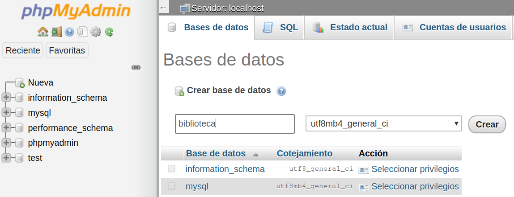

# Acceso a la base de datos

<div style="text-align: right">
<!--
<a target="_blank" href="slides/04a.html"></a>&nbsp;&nbsp;
-->
<a target="_blank" href="04a.pdf"></a>
</div>

<div></div>

Una vez vistas dos de las tres patas en que se sustenta el patrón MVC (las vistas y los controladores), en esta sección abordaremos la tercera de ellas: el modelo de datos. Con esto, trataremos algunas cuestiones importantes sobre cómo gestiona Laravel el acceso a bases de datos, y qué mecanismos ofrece para sincronizar los datos de nuestra aplicación con los documentos o registros de una base de datos, así como para generar automáticamente la estructura de tablas y campos de la base de datos a partir del modelo de la aplicación.

## 1. Parámetros de conexión a la base de datos

Una de las primeras cosas que debemos hacer para configurar el acceso a la base de datos en nuestro proyecto es establecer los parámetros con los que conectar a dicha base de datos: nombre del servidor, usuario, contraseña, etc. Estos parámetros se definen en el archivo `.env` para cada entorno de despliegue de la aplicación (recuerda que este archivo no se sube a Git, por lo que cada entorno tendrá el suyo). Dentro de este archivo, debemos modificar las siguientes variables de entorno:

* `DB_CONNECTION`: tipo de SGBD a usar
* `DB_HOST`: dirección o IP del SGBD (*127.0.0.1* para conexión local)
* `DB_PORT`: puerto por el que el SGBD estará escuchando. Por ejemplo, el puerto por defecto para MySQL es 3306
* `DB_DATABASE`: nombre de la base de datos a la que conectar
* `DB_USERNAME`: login del usuario para conectar
* `DB_PASSWORD`: password del usuario para conectar

En cuanto al primer parámetro (`DB_CONNECTION`), aquí tenemos un listado de los sistemas más habituales, junto con sus puertos por defecto que podemos utilizar en `DB_PORT`:

|*Id* SGBD|Nombre SGBD|Puerto por defecto|
|---|---|:---:|
|mysql|MySQL/MariaDB|3306|
|oracle|Oracle|1521|
|pgsql|PostgreSQL|5432|
|sqlsrv|SQL Server|1433|
|sqlite|SQLite|-|

Por ejemplo, para nuestro ejemplo de la biblioteca, el archivo `.env` del proyecto podría quedar así, suponiendo el usuario y contraseña por defecto que se instala con XAMPP (usuario *root* y password vacío).

```
DB_CONNECTION=mysql
DB_HOST=127.0.0.1
DB_PORT=3306
DB_DATABASE=biblioteca
DB_USERNAME=root
DB_PASSWORD=
```

En el archivo `config/database.php` existen unos valores por defecto asociados a cada parámetro de configuración del archivo `.env`, de modo que si no se encuentra el parámetro, se toma el valor por defecto. Por ejemplo, el SGBD seleccionado si no se especifica ninguno es *mysql*, a juzgar por esta línea del archivo `database.php`:

```php
'default' => env('DB_CONNECTION', 'mysql'),
```

## 2. Creación de la base de datos

El único paso necesario desde fuera de Laravel para acceder a la base de datos será crearla. El resto de operaciones (creación de tablas, campos, claves, relaciones, datos, etc) se podrán hacer desde el propio Laravel, como iremos viendo más adelante.

La base de datos podemos crearla a través de algún administrador que tengamos disponible (por ejemplo, *phpMyAdmin* para bases de datos MySQL), o bien por línea de comandos, conectando con el SGBD en cuestión y creando la base de datos. Para la máquina virtual que estamos utilizando, podemos acceder a *phpMyAdmin* teniendo XAMPP en marcha (tanto el servidor Apache como el de MySQL) y accediendo a la URL *http://localhost/phpmyadmin*, normalmente.

En nuestro caso, tendremos que crear una base de datos llamada "biblioteca", tal y como hemos especificado en la propiedad `DB_DATABASE` del archivo `.env`. Vamos a la opción *Nueva* del panel izquierdo y escribimos el nombre de la nueva base de datos en el formulario que aparecerá. Pulsando el botón de *Crear* ya aparecerá la nueva base de datos en el listado izquierdo.

<div align="center">
    
</div>
