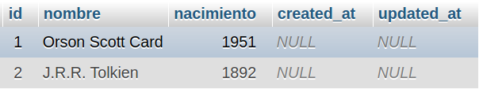
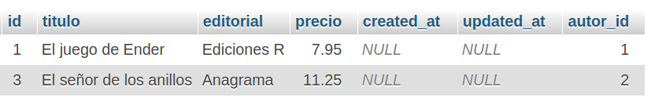

# Relaciones entre modelos

<div style="text-align: right">
<!--
<a target="_blank" href="slides/04d.html"></a>&nbsp;&nbsp;
-->
<a target="_blank" href="04d.pdf"></a>
</div>

<div></div>

En esta sesión veremos qué tipos de relaciones se pueden establecer entre los modelos de la aplicación, y cómo se reflejan automáticamente en la base de datos. Para ello, Eloquent permite definir relaciones de varios tipos entre tablas. Éstas se definen a través de los distintos modelos involucrados en la relación, como veremos a continuación.

## 1. Relaciones uno a uno o *one to one*

Supongamos que tenemos dos modelos `Usuario` y `Telefono`, de modo que podemos establecer una relación *uno a uno* entre ellos: un usuario tiene un teléfono, y un teléfono pertenece a un usuario.

Para reflejar esta relación en tablas, una de las dos debería tener una referencia a la otra. En este caso, podríamos tener un campo `telefono_id` en la tabla de `usuarios` que indique el teléfono que pertenece a dicho usuario, o viceversa (un campo `usuario_id` en la tabla `telefonos` que indique a qué usuario pertenece un teléfono). Conceptualmente es más correcta la primera opción (el usuario *tiene* el teléfono), así que seguiremos ese primer ejemplo. Es importante que el campo nuevo en la tabla `usuarios` se llame `telefono_id`, como veremos a continuación.

Para indicar que *un usuario tiene un teléfono*, añadimos un nuevo método en el modelo de `Usuario`, que se llame igual que el modelo con el que queremos conectar (`telefono`, en este caso). Dentro, usaremos el método `hasOne` del modelo de usuario para indicar que un objeto de este tipo *tiene un* objeto del otro modelo (teléfono):

```php
class Usuario extends Model
{
    public function telefono()
    {
        return $this->hasOne(Telefono::class);
    }
}
```

Ahora, si queremos obtener el teléfono de un usuario, basta con que hagamos esto:

```php
$telefono = Usuario::findOrFail($id)->telefono;
```

Hemos empleado una característica de Eloquent denominada *propiedades dinámicas*, por la cual podemos referenciar un método de relación como si fuera una propiedad (en lugar de usar `telefono()`, hemos empleado `telefono`).

La instrucción anterior obtiene el objeto `Telefono` asociado con el usuario buscado (a través del `$id` del teléfono). Para que esta asociación tenga efecto, es preciso que en la tabla `usuarios` exista un campo `telefono_id` y que se corresponda con un campo `id` de la tabla de `telefonos`, de modo que Eloquent establece la conexión entre una y otra tabla. Deberemos definir una nueva migración de modificación sobre la tabla *usuarios* para añadir ese nuevo campo, o refrescar la migración original con él y borrar los contenidos previos. 

Si queremos utilizar otros campos distintos en una y otra tabla para conectarlas, debemos indicar dos parámetros más al llamar a `hasOne`. Por ejemplo, así relacionaríamos las dos tablas anteriores, indicando que la clave ajena de `usuarios` a `telefonos` es `idTelefono`, y que la clave primaria de `telefonos` a la que se referencia es `codigo`:

```php
return $this->hasOne(Telefono::class, 'idTelefono', 'codigo');
```

También es posible obtener la **relación inversa**, es decir, a partir de un teléfono, obtener el usuario al que pertenece. Para ello, añadimos un método `usuario` en el modelo `Telefono` y empleamos el método `belongsTo` para indicar a qué modelo se asocia:

```php
class Telefono extends Model
{
    public function usuario()
    {
        return $this->belongsTo(Usuario::class);
    }
}
```

Nuevamente, podemos especificar otros nombres de clave pasando parámetros adicionales a `belongsTo`, igual que se hace para `hasOne`.

De este modo, si queremos obtener el usuario a partir del teléfono, podemos hacerlo así:

```php
$usuario = Telefono::findOrFail($idTelefono)->usuario();
```

### 1.1. Guardar datos relacionados

Supongamos que queremos guardar un usuario con su teléfono asociado. Podemos simplemente guardar el *id* del teléfono como un campo más del usuario:

```php
// Buscamos el teléfono que queremos asociar
// (suponiendo que existe previamente)
$telefono = Telefono::findOrFail($idTelefono);
$usuario = new Usuario();
$usuario->nombre = "Pepe";
$usuario->email = "pepe@gmail.com";
$usuario->telefono_id = $telefono->id;
$usuario->save();
```

Pero, además, podemos vincular ambos objetos en la relación, usando el método `associate`, de este modo:

```php
// Buscamos el teléfono que queremos asociar
// (suponiendo que existe previamente)
$telefono = Telefono::findOrFail($idTelefono);
$usuario = new Usuario();
$usuario->nombre = "Pepe";
$usuario->email = "pepe@gmail.com";
$usuario->telefono()->associate($telefono);
$usuario->save();
```

## 2. Relaciones uno a muchos o *one to many*

Para ilustrar esta relación veamos otro ejemplo: supongamos que tenemos los modelos `Autor` y `Libro`, de modo que un autor puede tener varios libros, y un libro está asociado a un autor.

La forma de establecer la relación entre ambos consistirá en añadir en la tabla de `libros` una clave ajena al autor al que pertenece. A la hora de plasmar esta relación en los modelos, se hace de forma similar al caso anterior, sólo que en lugar de utilizar el método `hasOne` en la clase `Autor` usaríamos el método `hasMany`:

```php
class Autor extends Model
{
    public function libros()
    {
        return $this->hasMany(Libro::class);
    }
}
```

Igual que ocurría antes, se asume que la tabla de libros tiene una clave primaria `id`, y que la clave ajena correspondiente hacia la tabla de autores es `autor_id`. De lo contrario, se pueden especificar otros pasando más parámetros a `hasMany`.

De este modo obtenemos los libros asociados a un autor:

```php
$libros = Autor::findOrFail($id)->libros();
```

Finalmente, también podemos establecer la **relación inversa**, y recuperar el autor al que pertenece un determinado libro, definiendo un método en la clase `Libro` que emplee `belongsTo`, como en las relaciones uno a uno:

```php
class Libro extends Model
{
    public function autor()
    {
        return $this->belongsTo(Autor::class);
    }
}
```

Y obtener, por ejemplo, el nombre del autor a partir del libro:

```php
$nombreAutor = Libro::findOrFail($id)->autor->nombre;
```

### 2.1. Aplicando esta relación en nuestro ejemplo

Esta relación la podemos dejar plasmada en nuestro ejemplo de la biblioteca, definiendo un nuevo modelo `Autor` con su correspondiente migración, y relacionando los modelos. Para ello, seguiremos estos pasos:

* Creamos una nueva migración de modificación sobre la tabla de *libros*, para añadir un nuevo campo `autor_id`. 

```
php artisan make:migration nuevo_campo_autor_libros --table=libros
```

```php
class NuevoCampoAutorLibros extends Migration
{
    public function up()
    {
        Schema::table('libros', function(Blueprint $table) {
            $table->integer('autor_id');
        });
    }

    public function down()
    {
        Schema::table('libros', function(Blueprint $table) {
            $table->dropColumn('autor_id');
        });
    }
}
```

```
php artisan migrate
```

* Creamos de golpe el modelo, la migración y el controlador de autores (aunque el controlador no lo vamos a utilizar, al menos por el momento). El modelo `Autor` debe quedar en la carpeta `app\Models`, junto con el de usuarios y el de libros.

```
php artisan make:model Autor -mcr
```

> **NOTA**: en este punto, deberás renombrar a mano la migración, ya que el plural que asignará Laravel por defecto será *autors*, y no *autores*. Recuerda cambiar tanto el nombre del fichero de la migración, como el nombre de la tabla a la que se referencia en los métodos `up` y `down`.

* Editamos la migración para definir los campos que tendrá la nueva tabla de autores, en su método `up`: un nombre y un año de nacimiento (opcional):

```php
return new class extends Migration
{
    public function up()
    {
        Schema::create('autores', function(Blueprint $table) {
            $table->id();
            $table->string('nombre');
            $table->integer('nacimiento')->nullable();
            $table->timestamps();
        });
    }
}
```

```
php artisan migrate
```

* Añadimos en el modelo `Autor` que la tabla asociada será `autores` (de lo contrario, considera que será *autors*. Además, definimos una relación de uno a muchos con los libros, añadiendo el método siguiente:

```php
class Autor extends Model
{
    protected $table = 'autores';
    ...

    public function libros()
    {
        return $this->hasMany(Libro::class);
    }
}
```

* Recíprocamente, añadimos al modelo `Libro` este otro método, para poder recuperar un autor a partir de uno de sus libros:

```php
class Libro extends Model
{
    ...

    public function autor()
    {
        return $this->belongsTo(Autor::class);
    }
}
```

* Utilizando *phpMyAdmin*, creamos a mano un par de autores en la tabla de autores, y los relacionamos con algunos de los libros que haya en la tabla de libros, añadiendo también a mano el *id* de cada autor en la clave ajena correspondiente de los libros. Por ejemplo:

<div align="center">
    
</div>
<div align="center">
    
</div>

* Para probar cómo funcionan las relaciones, vamos primero a crear un nuevo libro asociado al autor 1. Definimos una ruta de prueba en el archivo `routes/web.php` con este código (deberemos incorporar con `use` los modelos de `Autor` y `Libro`):

```php
Route::get('relacionPrueba', function() {
    $autor = Autor::findOrFail(1);
    $libro = new Libro();
    $libro->titulo = "Libro de prueba " . rand();
    $libro->editorial = "Editorial de prueba";
    $libro->precio = 5;
    $libro->autor()->associate($autor);
    $libro->save();

    return redirect()->route('libros.index');
});
```

* Ahora, modificamos la vista `libros/index.blade.php` para que, en el listado, utilice las relaciones entre tablas para mostrar el nombre del autor entre paréntesis junto al título de cada libro:

<!---->
```php
@forelse($libros as $libro)
    <li><a href="{{ route('libros.show', $libro) }}">
        {{ $libro->titulo }} ({{ $libro->autor->nombre }})
    </a></li>
@empty
    <li>No se encontraron libros</li>
@endforelse
```
<!---->

* Podemos probar las dos cosas accediendo respectivamente a estas dos URLs (suponiendo que el servidor está escuchando en *localhost* por el puerto 8000):

```
http://localhost:8000/relacionPrueba
http://localhost:8000/libros
```

### 2.2. Acceso eficiente a datos relacionados. *Eager loading*

En el ejemplo anterior, hemos visto cómo, dado un libro, podemos obtener el nombre del autor de este modo en una vista Blade:

<!---->
```php
{{ $libro->autor->nombre }}
```
<!---->

Sin embargo, este código provoca una nueva consulta en la base de datos para buscar los datos del autor asociado al libro, con lo que, para un listado de 100 libros, estaremos haciendo 100 consultas adicionales para extraer la información de los respectivos autores. 

Para evitar esta sobrecarga, podemos emplear una técnica llamada *eager loading* (que en español podríamos traducir como *carga apresurada* o *impaciente*). Consiste en emplear el método `with` para indicar qué relación queremos dejar pre-cargada en el resultado. Por ejemplo, si indicamos algo así en la función `index` del controlador de libros:

```php
public function index()
{
    $libros = Libro::with('autor')->get();
    return view('libros.index', compact('libros'));
}
```

## 3. Relaciones muchos a muchos o *many to many*

Estas relaciones son más difíciles de plasmar, ya que es necesario contar con una tercera tabla que relacione las dos tablas afectadas. Pero vayamos por partes...

Para ilustrar este caso, supongamos los modelos `Usuario` y `Rol`, de modo que un usuario puede tener varios roles, y un rol puede ser asignado a varios usuarios. Nuevamente, definimos un método en el modelo `Usuario` que utilice el método `belongsToMany` para indicar con qué otro modelo se relaciona:

```php
class Usuario extends Model
{
    public function roles()
    {
        return $this->belongsToMany(Rol::class);
    }
}
```

Así ya podremos acceder a los roles de un usuario:

```php
$roles = Usuario::findOrFail($id)->roles;
```

En este caso, al otro lado de la relación hacemos lo mismo: definimos un método en el modelo `Rol` que indique con `belongsToMany` que puede pertenecer a varios usuarios:

```php
class Rol extends Model
{
    public function usuarios()
    {
        return $this->belongsToMany(Usuario::class);
    }
}
```

A efectos de automatización, es decir, para que Eloquent establezca los nexos de forma automática, si queremos establecer una relación muchos a muchos entre un modelo `A` y otro `B`, se asume que existirá otra tabla `a_b` (el orden en que se colocan los nombres de las tablas es alfabético), con los campos `a_id` y `b_id`, que relacionen los dos modelos. En nuetro caso, se asumirá que existe una tabla `rol_usuario` con un campo `rol_id` y otro llamado `usuario_id`, que enlacen con los correspondientes `id` de las tablas de usuarios y roles. Si esto no fuera así, podemos pasar más parámetros a `belongsToMany` para indicarlo. 

En el caso de las relaciones muchos a muchos, es posible que nos interese acceder a algún dato de esa tabla intermedia que los relaciona. En ese caso, hacemos uso del atributo `pivot`, predefinido, y que apunta a la tabla o modelo intermedio entre los dos relacionados. Por ejemplo, si quisiéramos obtener la fecha de creación de la relación entre un usuario y un rol, podríamos hacer esto:

```php
$roles = Usuario::findOrFail($id)->roles;

for($roles as $rol)
{
    echo $rol->pivot->created_at;
}
```

## 4. Más información

Sobre estas relaciones existen algunas variantes, y formas de personalizar las tablas y campos afectados. Se puede consultar más información en la [documentación oficial de Eloquent](https://laravel.com/docs/eloquent-relationships#defining-relationships).
