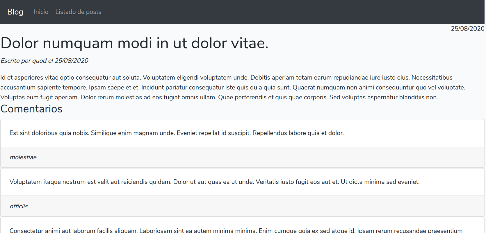

# Ejercicios propuestos - Parte 4 (II)

## Ejercicio 1

Sobre el proyecto **blog** de la sesión anterior, vamos a añadir estos cambios:

* Crea una relación *uno a muchos* entre el modelo de `Usuario` y el modelo de `Post`, ambos ya existentes en la aplicación, de forma que un post es de un usuario, y un usuario puede tener muchos posts. Deberás definir una nueva migración de modificación sobre la tabla *posts* que añada un nuevo campo `usuario_id`, y establecer a partir de él la relación, como hemos hecho en el ejemplo con autores y libros.
* Crea desde *phpMyAdmin* una serie de usuarios de prueba en la tabla *usuarios*, y asocia algunos de ellos a los posts que haya. 
* Modifica la vista `posts/index.blade.php` para que, junto al título de cada post, entre paréntesis, aparezca el login del usuario que lo creó. 

## Ejercicio 2

Continuamos con el proyecto **blog** anterior. Ahora añadiremos lo siguiente:

* Crea un *seeder* llamado `UsuariosSeeder`, con un factory asociado llamado `UsuarioFactory` (renombra el que viene por defecto `UserFactory` para aprovecharlo). Crea con esto 3 usuarios de prueba, con *logins* que sean únicos y de una sola palabra (usa el *faker*), y passwords también de una sola palabra, sin encriptar (para poderlos identificar después, llegado el caso).
* Crea otro *seeder* llamado `PostsSeeder` con un factory asociado llamado `PostFactory`. En el *factory*, define con el *faker* títulos aleatorios (frases) y contenidos aleatorios (textos largos). Usa el *seeder* para crear 3 posts para cada uno de los usuarios existentes.

Utiliza la opción `php artisan migrate:fresh --seed` para borrar todo contenido previo y poblar la base de datos con estos nuevos elementos.  Comprueba después desde la página del listado de posts, y desde *phpMyAdmin*, que la información que aparece es correcta.

## Ejercicio 3

***Opcional***

Añade al proyecto **blog** un nuevo modelo llamado `Comentario`, junto con su migración y controlador asociados. Cada comentario tendrá como campo el contenido del comentario, y estará relacionado *uno a muchos* con el modelo `Usuario`, de forma que un usuario puede tener muchos comentarios, y cada comentario pertenece a un usuario. También tendrá una relación *uno a muchos* con el modelo `Post`, de modo que un comentario pertenece a un post, y un post puede tener muchos comentarios. Por lo tanto, la migración de los comentarios deberá tener como campos adicionales la relación con el usuario (`usuario_id`) y con el post al que pertenece (`post_id`).

Aplica la migración para reflejar la nueva tabla en la base de datos, y utiliza un *seeder* y un *factory* para crear 3 comentarios en cada post, con el usuario que sea. A la hora de aplicar todo esto, borra los contenidos previos de la base de datos (`migrate:fresh --seed`).

> **AYUDA**: si quieres elegir un usuario al azar como autor de cada comentario, puedes hacer algo así:

```php
Usuario::inRandomOrder()->first();
``` 

> En este caso, sería conveniente que ese usuario aleatorio se añada directamente en el *factory* del comentario, y no en el *seeder*, ya que de lo contrario es posible que genere el mismo usuario para todos los comentarios de un post.

En la ficha de los posts (vista `posts/show.blade.php`), añade el código necesario para mostrar el *login* del usuario que ha hecho el *post*, y el listado de comentarios asociado al post, mostrando para cada uno el *login* del usuario que lo hizo, y el texto del comentario en sí. Utiliza también la librería *Carbon* para mostrar la fecha de creación del post (o la de los comentarios, como prefieras) en formato *d/m/Y*. 

Aquí tienes una captura de pantalla de cómo podría quedar:

<div align="center">
    
</div>

**¿Qué entregar?**

Como entrega de esta sesión deberás comprimir el proyecto **blog** con todos los cambios incorporados, y eliminando las carpetas `vendor` y `node_modules` como se explicó en las sesiones anteriores. Renombra el archivo comprimido a `blog_05.zip`.