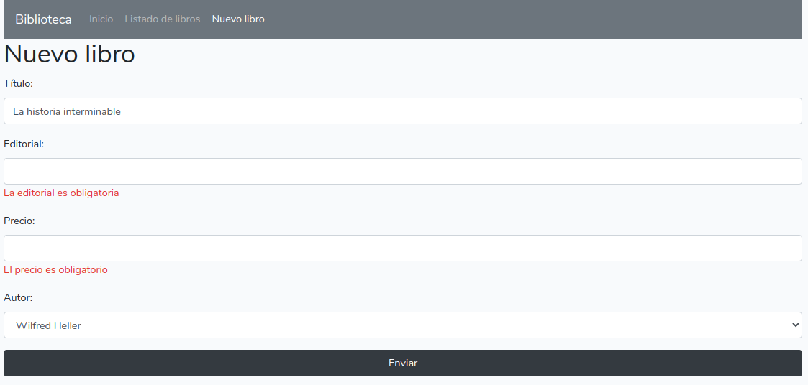

# Validación de formularios

<div style="text-align: right">
<!--
<a target="_blank" href="slides/05b.html"></a>&nbsp;&nbsp;
-->
<a target="_blank" href="05b.pdf"></a>
</div>

<div></div>

Además de aplicar una validación en el cliente a través de HTML5, que también es recomendable, se deben validar los datos en el servidor. Para hacer esto, el propio objeto `request` proporciona un método llamado `validate`, al que le pasamos un array con las reglas de validación.

## 1. Ejemplo de validación

Por ejemplo, así comprobaríamos que el título y la editorial de los libros de nuestra *biblioteca* se han enviado, y que el título tiene un tamaño mínimo de 3 caracteres. Además, comprobamos que el precio es un valor numérico real positivo.

```php
public function store()
{
    request()->validate(
        [
            'titulo' => 'required|min:3',
            'editorial' => 'required',
            'precio' => 'required|numeric|min:0'
        ]
    );

    // ... Código para procesar el formulario
}
```

> **NOTA**: notar que en varios campos se han añadido dos o más reglas de validación enlazadas por una barra vertical. Para el precio, por ejemplo, se comprueba que se ha enviado, que es numérico y que es mayor o igual que 0. Podéis consultar en la [documentación de Laravel](https://laravel.com/docs/validation) sobre otras reglas de validación disponibles, especialmente en el apartado de *Available Validation Rules*.

## 2. Utilizar *form requests* para validaciones más complejas

Si tenemos que validar unos pocos campos, puede ser adecuado llamar al método `validate` desde el propio método del controlador, pero para formularios más grandes el código puede crecer demasiado.

Una alternativa que ofrece laravel es crear un *form request*, una clase adicional que contiene la lógica de validación de una petición. Se crean con el comando `php artisan`, y la opción `make:request`, seguida del nombre de la clase a crear:

```
php artisan make:request LibroPost
```

Esta clase se almacena por defecto en `app/Http/Requests`, y contiene un par de métodos predefinidos:

* `authorize`: devuelve un booleano dependiendo de si el usuario actual está autorizado a enviar la petición o no. Para muchos formularios que no requieran autorización previa podemos simplemente devolver `true`. Será lo que haremos de momento en este formulario.
* `rules`: este es el método que más nos interesa. Devuelve un array de reglas de validación como las que teníamos en el controller, así que movemos ese código aquí:

```php
public function rules()
{
    return [
        'titulo' => 'required|min:3',
        'editorial' => 'required',
        'precio' => 'required|numeric|min:0'
    ];
}
```

Ahora, en el método del controlador simplemente tenemos que inyectar este *form request* como parámetro (si observamos la clase que se ha creado, es un subtipo de `Request`), y usarlo para validar. La validación es automática, es decir, no tenemos que añadir más código al controlador que el objeto inyectado como parámetro, que se encargará de validar la propia petición que contiene a través del método `rules`.

```php
public function store(LibroPost $request)
{
    // Si entramos aquí, el formulario es válido
}
```

## 3. Mostrar mensajes de error

Si la validación es correcta, se retornará el dato del final de la función, pero si falla algún campo, se volverá a la página del formulario, con la información del error que se haya producido. Podemos acceder desde cualquier lugar de Laravel a la variable `$errors` con los errores que se hayan producido en una operación determinada. Esta variable tiene un método booleano llamado `any` que comprueba si hay algún error, y otro método llamado `all` que devuelve el array de errores producidos. Combinando estos dos métodos con Blade, podemos mostrar el listado de errores de validación antes del formulario, de esta forma:

<!---->
```php
@if ($errors->any())
    <ul>
    @foreach($errors->all() as $error)
        <li>{{ $error }}</li>
    @endforeach
    </ul>
@endif
<form ...>
    @csrf
    ...
</form>
```
<!---->

También podemos emplear el método `first` del array de errores para obtener el primer error asociado a un campo, y mostrarlo bajo o sobre el campo en cuestión. Por ejemplo:

<!---->
```html
<form action="{{ route('libros.store') }}" method="POST">

    @csrf

    <div class="form-group">
        <label for="titulo">Título:</label>
        <input type="text" class="form-control" name="titulo" 
            id="titulo">
        @if ($errors->has('titulo'))
            <div class="text-danger">
                {{ $errors->first('titulo') }}
            </div>
        @endif
    </div>

    ...
```
<!---->

Además, podemos **personalizar el mensaje de error** a mostrar, redefiniendo en la clase del *form request* el método `messages`. En este método devolvemos un array con el mensaje a mostrar para cada posible error de validación. Por ejemplo:

```php
public function messages()
{
    return [
        'titulo.required' => 'El título es obligatorio',
        ...
    ];
}
```

De forma alternativa, si optamos por validar el formulario en el propio controlador, este array de mensajes se pasa como segundo parámetro en la llamada al método `validate`:

```php
request()->validate(
    [
        'titulo' => 'required|min:3',
        'editorial' => 'required',
        'precio' => 'required|numeric|min:0'
    ], [
        'titulo.required' => 'El título es obligatorio',
        ...
    ]
);

```

En definitiva, conseguiremos mostrar mensajes de error para los campos que hayan dado errores al validar:

<div align="center">
    
</div>

### 3.1. Recordar valores enviados

Un problema derivado de la validación de datos es que, al volver a la página del formulario tras un error, los campos que ya se han examinado hasta el error, aunque fueran correctos, han perdido el valor que tenían, y puede resultar engorroso tenerlos que rellenar otra vez. Para mantener su antiguo valor, podemos añadir el atributo `value` en cada campo del formulario, y utilizar con Blade una función llamada `old`, que permite acceder al anterior valor de un determinado campo, referenciado por su nombre:

<!---->
```html
<form action="{{ route('libros.store') }}" method="POST">

    @csrf

    <div class="form-group">
        <label for="titulo">Título:</label>
        <input type="text" class="form-control" name="titulo" 
            id="titulo" value="{{ old('titulo') }}">
        @if ($errors->has('titulo'))
            <div class="text-danger">
                {{ $errors->first('titulo') }}
            </div>
        @endif
    </div>

    ...
```
<!---->

En el caso de áreas de texto, usamos esta expresión dentro del área (es decir, entre la etiqueta de apertura y la de cierre del *textarea*):

<!---->
```html
<textarea name="mensaje" placeholder="Mensaje...">
{{ old('mensaje') }}
</textarea>
```
<!---->
