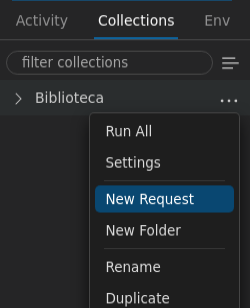
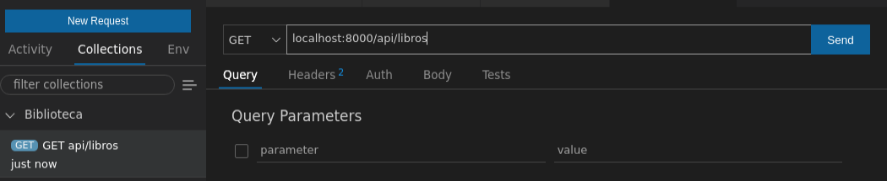
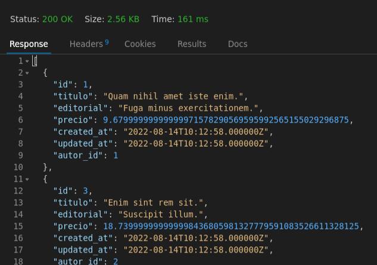
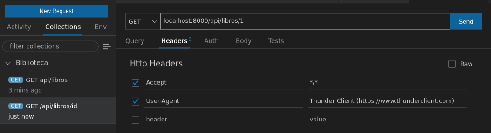
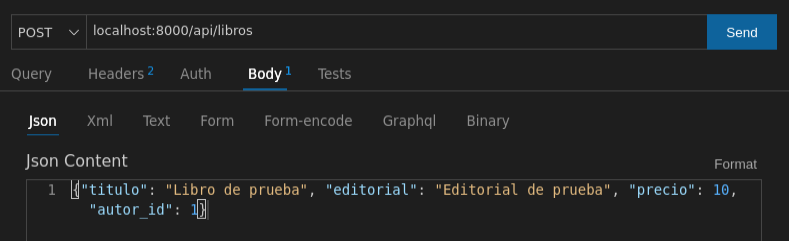
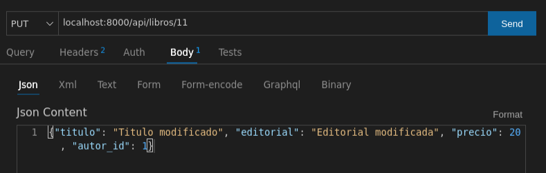
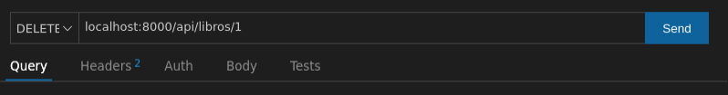
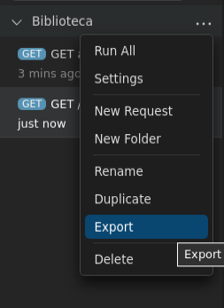

# Prueba de servicios REST

<!--
&nbsp;&nbsp;
-->

Ya hemos visto que probar unos servicios de listado (GET) es sencillo a través de un navegador. Pero los servicios de inserción (POST), modificación (PUT) o borrado (DELETE) exigen de otras herramientas para poder ser probados. Podríamos definir formularios con estos métodos encapsulados, pero el esfuerzo de definir esos formularios para luego no utilizarlos más no merece mucho la pena. Existen varias herramientas alternativas para probar estos servicios, como por ejemplo [Postman](https://www.postman.com/), pero para evitar depender de más aplicaciones externas, vamos a utilizar la extensión **ThunderClient** de Visual Studio Code, que ya deberíamos tener instalada siguiendo los pasos del apartado de [software necesario](01b).

Para utilizar esta extensión deberemos seleccionar su icono asociado en la barra izquierda:

    

Es aconsejable que nuestras peticiones las agrupemos en colecciones (*collections*) de forma que cada colección se centre en un proyecto o aplicación concreta. Para ello vamos a la pestaña de colecciones y elegimos crear una, con el nombre que queramos (por ejemplo, *Biblioteca*).

    

Desde el botón de puntos suspensivos junto al nombre de la colección podremos añadir nuevas peticiones asociadas a dicha colección (*New Request*), y después le pondremos un nombre.

    

## 1. Añadir peticiones GET

Para añadir una petición GET, podemos en primer lugar identificarla con su nombre (por ejemplo, *GET /api/libros*), y en el panel que se abrirá definimos la URL de acceso (también podemos elegir el tipo de comando: GET, POST, etc). Por ejemplo:

    

Si pulsamos en el botón de *Send*, podemos ver la respuesta emitida por el servidor en el panel de respuesta:

    

Siguiendo estos mismos pasos, podemos también crear una nueva petición para obtener un contacto a partir de su *id*, por GET:

    

Bastaría con reemplazar el *id* de la URL por el que queramos consultar realmente.

## 2. Añadir otros tipos de peticiones (POST, PUT, DELETE)

### 2.1. Peticiones POST

Las peticiones POST difieren de las peticiones GET en que se envía cierta información en el cuerpo de la petición. Esta información normalmente son los datos que se quieren añadir en el servidor. ¿Cómo podemos hacer esto con *ThunderClient*?

En primer lugar, creamos una nueva petición, elegimos el comando POST y definimos la URL (en este caso, *localhost:8080/api/libros*). Entonces, hacemos clic en la pestaña *Body*, bajo la URL, y establecemos el tipo como *JSON* para que nos deje escribirlo en dicho formato. Después, en el cuadro de texto bajo estas opciones, especificamos el objeto JSON que queremos enviar para insertar:

    

Al enviar la petición, podremos ver en el cuadro la respuesta (en este caso, el documento que se acaba de insertar).

### 2.2. Peticiones PUT

En el caso de peticiones PUT, procederemos de forma similar a las peticiones POST vistas antes: debemos elegir el comando (PUT en este caso), la URL, y completar el cuerpo de la petición con los datos que queramos modificar del contacto. En este caso, además, el *id* del contacto lo enviaremos también en la propia URL:

    

### 2.3. Peticiones DELETE

Para peticiones DELETE, la mecánica es similar a la ficha del libro, cambiando el comando GET por DELETE, y sin necesidad de establecer nada en el cuerpo de la petición:

    

## 3. Exportar/Importar colecciones

Podemos exportar e importar nuestras colecciones en *ThunderClient*, de forma que podemos llevarlas de un equipo a otro. Para **exportar** una colección, hacemos clic en el botón de puntos suspensivos (...) que hay junto a ella en el panel izquierdo, y elegimos *Export*.

    

Si queremos **importar** una colección previamente exportada, podemos hacer clic en el botón para crear colecciones, y elegimos la opción *Import*:

    

En cualquiera de los dos casos, las colecciones se exportan/importan a/desde un archivo en formato JSON que contiene la información de cada petición. Además, el formato de este archivo suele ser compatible entre aplicaciones del mismo estilo, de modo que un archivo exportado en Postman podemos importarlo en *ThunderClient*, y viceversa.
